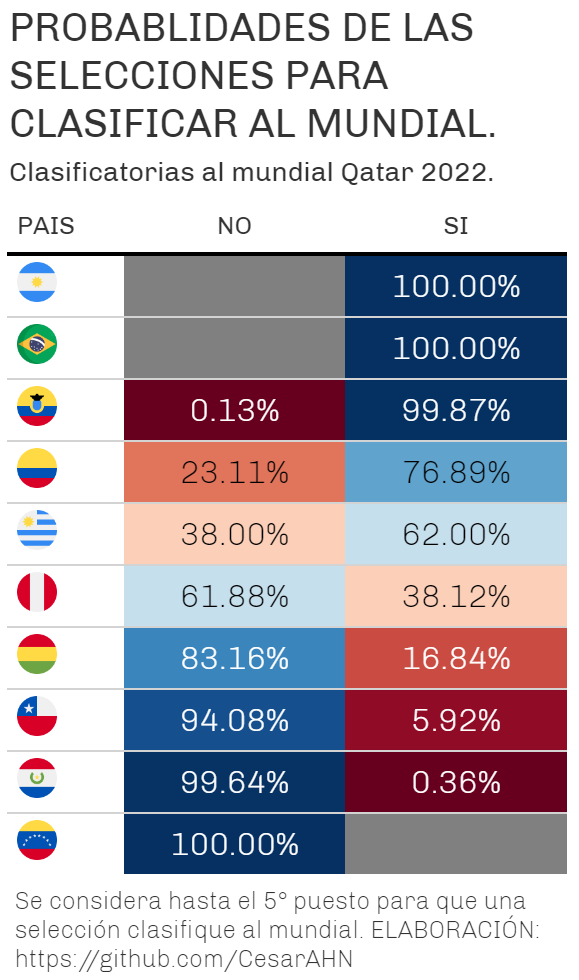

```{r, echo = FALSE}
knitr::opts_chunk$set(
  collapse = TRUE,
  comment = "#",
  fig.path = "README-"
)
```

# BIENVENIDOS!!!

# PROBABILIDADES DE CLASIFICAR AL MUNDIAL QATAR 2022 - CONMEBOL

Se crea este repertorio para poder determinar las probabilidades de cada una de las selecciones de la CONMEBOL, para clasificar al mundial Qatar 2022. Para tal fin, primero se crea una función que permita calcular los resultados posibles de los partidos (goles a favor, goles en contra, diferencia de goles, puntos y puesto), desde la fecha 15 a la fecha 18.

Una vez que se obtiene la función se realiza un proceso montecarlo con el cual se evalúa la función 10,000 veces de cada compromiso de estas cuatro fechas. Con lo cual se obtiene 10,000 resultados posibles por cada partido. 

Al final se calcula las probabilidades en función a los resultados posibles que se obtendrían en la fecha 18 de las clasificatorias. 

USted encuentra todo el código en este repositorio, el archivo se llama **script-probabilidades-qatar-2022.R**

## Tabla de posiciones. 
Se obtendrá la tabla de posiciones dese la web de espn, actualizado a la fecha `r Sys.Date()`. Para esto se usa el método de web scraping. 

```{r, message=FALSE, warning=FALSE, echo=FALSE}
library(dplyr)
library(rvest)
#devtools::install_github("CesarAHN/datametria")
library(datametria)
library(ggplot2)
library(tidyr)
library(gt)
#devtools::install_github("jthomasmock/gtExtras")
library(gtExtras)

```

```{r,message=FALSE, warning=FALSE, echo=FALSE, cache=TRUE}
#----------------------
# Tabla de posiciones. 
#----------------------
pw<-read_html("https://www.espn.com.mx/futbol/posiciones/_/liga/fifa.worldq.conmebol")

tab_pos<-cbind(pw %>% 
                 html_nodes("table.Table.Table--align-right.Table--fixed.Table--fixed-left") %>% html_table() %>% 
                 as.data.frame(),
               pw %>% 
                 html_nodes("div.Table__ScrollerWrapper.relative.overflow-hidden") %>% html_table() %>% 
                 as.data.frame())

names(tab_pos)[1]<-"SELECCION"

tab_pos$SELECCION<-limpiecito(gsub("(.*)([A-Z][a-z]+)","\\2",tab_pos$SELECCION))
```

```{r, eval=FALSE}
tab_pos %>% as_tibble() %>% gt() %>%
  gt_theme_espn() %>% tab_header(title = "TABLA DE POSICIONES CONMEBOL - FECHA 14.",
             subtitle = "Clasificatorias al mundial Qatar 2022.")
```

<p align="center"></p>

Hasta la fecha 14, se tiene pendiente el partido entre Brasil y Argentina. Para el cálculo se supondrá que la selección de Argentina gana este partido por una diferencia de 3 a 0, como se da en los casos de walkover. Por lo cual la tabla de posiciones quedaría:

```{r, echo=FALSE}
# Argentina gana el partido pendiente.
# Por 3 a 0. 
tab_pos[1:2,2]<-tab_pos[1:2,2]+1
tab_pos[1:2,3]<-tab_pos[1:2,3]+c(0,1)
tab_pos[1:2,4]<-tab_pos[1:2,4]+0
tab_pos[1:2,5]<-tab_pos[1:2,5]+c(1,0)
tab_pos[1:2,6]<-tab_pos[1:2,6]+c(0,3)
tab_pos[1:2,7]<-tab_pos[1:2,7]+c(3,0)
tab_pos[1:2,8]<-tab_pos[1:2,8]+c(-3,3)
tab_pos[1:2,9]<-tab_pos[1:2,9]+c(0,3)
```

```{r, eval=FALSE}
tab_pos %>% as_tibble() %>% gt() %>%
  gt_theme_espn() %>% tab_header(title = "TABLA DE POSICIONES CONMEBOL - FECHA 14.",
             subtitle = "Clasificatorias al mundial Qatar 2022.") %>% 
  tab_source_note("En el supuesto de que Brasil pierda por 3 a 0 contra argentina (Partido pendiente).")
```

<p align="center"></p>

## Desempeño de las selecciones. 

Todos los países no tienen el mismo desempeño, por lo cual se crea un tipo de índice de desempeño en donde se consideran 3 características: el puntaje de desempeño como visitante, el puntaje de desempeño como local y el puntaje de desempeño dado por un especialista. Estas características reciben puntajes desde 1 hasta 10, en donde 1 significa que la selección tiene un desempeño paupérrimo, mientras que 10 significa que su desempeño es sobresaliente. 

Los tres puntajes son arbitrarios ya que el desempeño de partidos pasados no es indicador del desempeño futuro de una selección, por más objetivo que se piense que es, ya que, las selecciones juegan partidos luego de un lapso largo de tiempo lo cual influye en su desempeño. Por lo cual, solo se podría indicar que tan buenos son de visita (primera caracter´sitica), o que tan buenos son de locales (segunda característica) y su momento actual (tercera característica).

En ese sentido los puntajes lo he asignado en función a mis conocimientos deportivos. Usted puede asignar otros puntajes y obtendrá resultados distintos, pero es importante no perder la objetividad. 

A continuación muestro el puntaje para cada una de las selecciones como el ratio de juego de visita y local. El ratio de visita es la suma del desempeño de visita y la situación actual entre el puntaje máximo 20, de manera similar se obtiene para el ratio de local.

```{r, echo=FALSE, cache=TRUE}
#----------------------
# Puntaje de juego de visita.
# De 1 al 10, donde 1 es que le va muy mal jugando de visita y 10 que le va muy bien.
p_vist<-data.frame(SELECCION=tab_pos$SELECCION, p1=c(9,8,5,6,3,5,4,1,2,1))

# Puntaje de juego de local. 
# De 1 al 10, donde 1 es que le va muy mal jugando de local y 10 que le va muy bien.
p_loc<-data.frame(SELECCION=tab_pos$SELECCION, p2=c(10,9,7,6,6,6,5,8,4,3))

# Juicio de expertos. 
# De 1 al 10, donde 1 es que la selección según el experto no tiene un buen juego
# y 10 si considera el experto que sí tiene un buen juego.
p_exp<-data.frame(SELECCION=tab_pos$SELECCION, p3=c(9,9,5,6,5,5,5,4,4,2))

pp<-plyr::join_all(list(p_vist,p_loc,p_exp), by="SELECCION", type = "inner")
pp<-pp %>% mutate(ratio_vist=rowSums(select(., matches("p1|p3"))/20),
              ratio_loc=rowSums(select(., matches("p2|p3"))/20))
```


```{r, eval=FALSE}
pp %>% as_tibble() %>% gt() %>%
  gt_theme_espn() %>% tab_header(title = "ÍNDICE DE DESEMPEÑO DE LOCAL Y VISITANTE PARA CADA UNA DE LAS SELECCIONES", subtitle = "Visita, Local y Situación actual") %>% 
  tab_source_note("p1=Desempeño Visita.\np2=Desempeño Local.\np3=Desempeño Actual.")
```
<p align="center"></p>

## Función para el cálculo de resultados.

Se crea la función que determinará el resultado de cada partidos de las 4 fechas resltantes (de la fecha 15 a la fecha 18). Esta función considera dos argumentos: la tabla de posiciones consolidada hasta la fecha 14 y el desempeño de las selecciones. 

La función es la siguiente:

```{r}
clasificatorias<-function(tab_pos,pp){
  #---------------------
  # Fecha 15.
  f15<-c("COLOMBIA","PERU","VENEZUELA","BOLIVIA","PARAGUAY",
         "URUGUAY","CHILE","ARGENTINA","ECUADOR","BRASIL")
  bd15<-data.frame()
  for (i in seq(1,9,by=2)) {
    d<-(1-(pp[pp$SELECCION==f15[i],6]-pp[pp$SELECCION==f15[i+1],5]))
    if(d<1){
      a1<-rbind(data.frame(SELECCION=f15[i], GF_=sample(0:4,1, prob = c(1*d/10,2*d/10,3*d/10,4*d/10,(1-d)))),
                data.frame(SELECCION=f15[i+1], GF_=sample(0:4,1, prob = c((1-d),5*d/14,4*d/14,3*d/14,2*d/14)))) 
    } else {
      d<-(1-(pp[pp$SELECCION==f15[i+1],6]-pp[pp$SELECCION==f15[i],5]))
      a1<-rbind(data.frame(SELECCION=f15[i+1], GF_=sample(0:4,1, prob = c(1*d/10,2*d/10,3*d/10,4*d/10,(1-d)))),
                data.frame(SELECCION=f15[i], GF_=sample(0:4,1, prob = c((1-d),5*d/14,4*d/14,3*d/14,2*d/14)))) 
    }
    a1$GC_<-rev(a1$GF_)
    a1$PTS_<-ifelse(a1$GF_>a1$GC_,3,
                    ifelse(a1$GF_==a1$GC_,1,0))
    a1$G_<-ifelse(a1$PTS_==3,1,0)
    a1$P_<-rev(a1$G_)
    a1$E_<-ifelse(a1$PTS_==1,1,0) 
    bd15<-rbind(bd15,a1)
  }
  
  tab_pos15<-left_join(tab_pos,bd15, by="SELECCION")
  
  tab_pos15<-tab_pos15 %>% mutate(J=J+1, G=G+G_, E=E+E_, P=P+P_, GF=GF+GF_, GC=GC+GC_,
                                  PTS=PTS+PTS_, DIF=GF-GC) %>% select(1:9) %>% arrange(-PTS)
  
  #---------------------
  # Fecha 16.
  f16<-c("URUGUAY","VENEZUELA","PERU","ECUADOR","BRASIL","PARAGUAY",
         "BOLIVIA","CHILE","ARGENTINA","COLOMBIA")
  bd16<-data.frame()
  for (i in seq(1,9,by=2)) {
    d<-(1-(pp[pp$SELECCION==f16[i],6]-pp[pp$SELECCION==f16[i+1],5]))
    if(d<1){
      a1<-rbind(data.frame(SELECCION=f16[i], GF_=sample(0:4,1, prob = c(1*d/10,2*d/10,3*d/10,4*d/10,(1-d)))),
                data.frame(SELECCION=f16[i+1], GF_=sample(0:4,1, prob = c((1-d),5*d/14,4*d/14,3*d/14,2*d/14)))) 
    } else {
      d<-(1-(pp[pp$SELECCION==f16[i+1],6]-pp[pp$SELECCION==f16[i],5]))
      a1<-rbind(data.frame(SELECCION=f16[i+1], GF_=sample(0:4,1, prob = c(1*d/10,2*d/10,3*d/10,4*d/10,(1-d)))),
                data.frame(SELECCION=f16[i], GF_=sample(0:4,1, prob = c((1-d),5*d/14,4*d/14,3*d/14,2*d/14)))) 
    }
    a1$GC_<-rev(a1$GF_)
    a1$PTS_<-ifelse(a1$GF_>a1$GC_,3,
                    ifelse(a1$GF_==a1$GC_,1,0))
    a1$G_<-ifelse(a1$PTS_==3,1,0)
    a1$P_<-rev(a1$G_)
    a1$E_<-ifelse(a1$PTS_==1,1,0) 
    bd16<-rbind(bd16,a1)
  }
  
  tab_pos16<-left_join(tab_pos15,bd16, by="SELECCION")
  
  tab_pos16<-tab_pos16 %>% mutate(J=J+1, G=G+G_, E=E+E_, P=P+P_, GF=GF+GF_, GC=GC+GC_,
                                  PTS=PTS+PTS_, DIF=GF-GC) %>% select(1:9) %>% arrange(-PTS)
  
  #---------------------
  # Fecha 17.
  f17<-c("URUGUAY","PERU","COLOMBIA","BOLIVIA","BRASIL","CHILE",
         "PARAGUAY","ECUADOR","ARGENTINA","VENEZUELA")
  bd17<-data.frame()
  for (i in seq(1,9,by=2)) {
    d<-(1-(pp[pp$SELECCION==f17[i],6]-pp[pp$SELECCION==f17[i+1],5]))
    if(d<1){
      a1<-rbind(data.frame(SELECCION=f17[i], GF_=sample(0:4,1, prob = c(1*d/10,2*d/10,3*d/10,4*d/10,(1-d)))),
                data.frame(SELECCION=f17[i+1], GF_=sample(0:4,1, prob = c((1-d),5*d/14,4*d/14,3*d/14,2*d/14)))) 
    } else {
      d<-(1-(pp[pp$SELECCION==f17[i+1],6]-pp[pp$SELECCION==f17[i],5]))
      a1<-rbind(data.frame(SELECCION=f17[i+1], GF_=sample(0:4,1, prob = c(1*d/10,2*d/10,3*d/10,4*d/10,(1-d)))),
                data.frame(SELECCION=f17[i], GF_=sample(0:4,1, prob = c((1-d),5*d/14,4*d/14,3*d/14,2*d/14)))) 
    }
    a1$GC_<-rev(a1$GF_)
    a1$PTS_<-ifelse(a1$GF_>a1$GC_,3,
                    ifelse(a1$GF_==a1$GC_,1,0))
    a1$G_<-ifelse(a1$PTS_==3,1,0)
    a1$P_<-rev(a1$G_)
    a1$E_<-ifelse(a1$PTS_==1,1,0) 
    bd17<-rbind(bd17,a1)
  }
  
  tab_pos17<-left_join(tab_pos16,bd17, by="SELECCION")
  
  tab_pos17<-tab_pos17 %>% mutate(J=J+1, G=G+G_, E=E+E_, P=P+P_, GF=GF+GF_, GC=GC+GC_,
                                  PTS=PTS+PTS_, DIF=GF-GC) %>% select(1:9) %>% arrange(-PTS)
  
  #---------------------
  # Fecha 18.
  f18<-c("URUGUAY","PERU","COLOMBIA","BOLIVIA","BRASIL","CHILE",
         "PARAGUAY","ECUADOR","ARGENTINA","VENEZUELA")
  bd18<-data.frame()
  for (i in seq(1,9,by=2)) {
    d<-(1-(pp[pp$SELECCION==f18[i],6]-pp[pp$SELECCION==f18[i+1],5]))
    if(d<1){
      a1<-rbind(data.frame(SELECCION=f18[i], GF_=sample(0:4,1, prob = c(1*d/10,2*d/10,3*d/10,4*d/10,(1-d)))),
                data.frame(SELECCION=f18[i+1], GF_=sample(0:4,1, prob = c((1-d),5*d/14,4*d/14,3*d/14,2*d/14)))) 
    } else {
      d<-(1-(pp[pp$SELECCION==f18[i+1],6]-pp[pp$SELECCION==f18[i],5]))
      a1<-rbind(data.frame(SELECCION=f18[i+1], GF_=sample(0:4,1, prob = c(1*d/10,2*d/10,3*d/10,4*d/10,(1-d)))),
                data.frame(SELECCION=f18[i], GF_=sample(0:4,1, prob = c((1-d),5*d/14,4*d/14,3*d/14,2*d/14)))) 
    }
    a1$GC_<-rev(a1$GF_)
    a1$PTS_<-ifelse(a1$GF_>a1$GC_,3,
                    ifelse(a1$GF_==a1$GC_,1,0))
    a1$G_<-ifelse(a1$PTS_==3,1,0)
    a1$P_<-rev(a1$G_)
    a1$E_<-ifelse(a1$PTS_==1,1,0) 
    bd18<-rbind(bd18,a1)
  }
  
  tab_pos18<-left_join(tab_pos17,bd18, by="SELECCION")
  
  tab_pos18<-tab_pos18 %>% mutate(J=J+1, G=G+G_, E=E+E_, P=P+P_, GF=GF+GF_, GC=GC+GC_,
                                  PTS=PTS+PTS_, DIF=GF-GC) %>% select(1:9) %>% arrange(-PTS,-DIF,-G) %>% 
    mutate(PUESTO=1:n())
  return(tab_pos18)
}
```

la función es un fiel reflejo de la realidad en donde para determinar si una seleccción ganará, empatará o perderá depende del número de goles que se realizan en cada partido. El número de goles viene determinado por el desemepeño de cada selección (ratio de visita y ratio de local). El impacto se puede observar en la parte `prob = c(1*d/10,2*d/10,3*d/10,4*d/10,(1-d))` y `prob = c((1-d),5*d/14,4*d/14,3*d/14,2*d/14))`. En la cual existe una mayor probabilidad de ganar siempre y cuando el ratio ya se de local o de visita es mayor, pero como sabemos que en el fútbol nada está escrito, esta cantidad de goles viene determinado por un proceso aleatorio, lo cual permite que el número de goles no dependa exclusivamente de los ratios, sino también del azar. 

## Simulación a lo Montecarlo - 10,000 veces.

Se obtendrán los resultados como si se jugara cada partido 10,000 veces. Para esto usamos el método de montecarlo. 
```{r, eval=FALSE}
# Para tomar menos tiempo - Código eficiente.
resul<-data.frame(SELECCION=vector("character",length = 100000),
                  PTS=vector("numeric",length = 100000),
                  PUESTO=vector("integer",length = 100000))

# 10 mil escenarios.
for (i in 1:10000) {
  resul[(10*(i-1)+1):(10*(i-1)+10),]<-clasificatorias(tab_pos,pp)[,c(1,9,10)]
}
```

Este proceso demora un par de minutos, por lo que si usted desea aumentar el número de evaluaciones tendrá que considerar el tiempo de ejecución. Asimismo, al ser un proceso aleatorio el resultado que se obtiene en este proyecto, puede resultar distinto al suyo cuando corra el código, al margen de si dejo el desempeño sin modificaciones, esto debido a que está por detrás un proceso aleatorio. Pero los resultados no tendrán variaciones significativas, ya que el número de veces que se repitió el proceso es relativamente grande como para obtener resultados radicalmente diferentes. 

A continuación se muestra las 2 primeras simulaciones, en donde solo consideramos a las selecciones, los puntos, y el puesto en el que culminaría cada selección. Usted puede obtener, los goles, diferencia de goles, etc si toma en consideración a todas las columnas del resultado de la función `clasificatorias`.

```{r, echo=FALSE}
resul<-readRDS("simulaciones.rds")
```


```{r}
resul %>% head(n=20L)
```

## Resultados.

### A nivel de puntos obtenidos luego de la fecha 18.

Luego de realizar el cálculo 10,000 veces se obtiene la distribución de puntos que conseguiría cada selección. 

```{r, warning=FALSE, message=FALSE, echo=FALSE, fig.width=14, fig.height=9}
resul %>% arrange(SELECCION) %>% 
  ggplot(aes(x=PTS))+
  geom_histogram(fill="sienna2", alpha=.7)+
  facet_wrap(~SELECCION, scales = "free")+
  scale_x_continuous(breaks = seq(7,50,by=1))+
  labs(title = "DISTRIBUCIÓN DE LOS POSIBLES PUNTAJES POR SELECCIONES",
       subtitle = "Clasificatorias al mundial Qatar 2022.", x="Puntos", y="Frecuencia",
       caption = "Resultados luego de 10,000 repeticiones.\nELABORACIÓN:https://github.com/CesarAHN")+
  theme_bw()+
  theme(plot.caption = element_text(face = "bold", size = 8),
        plot.title = element_text(face = "bold"))
```

### A nivel de puestos obtenidos luego de la fecha 18.

A continuación se muestra la distribución de puestos que obtendría cada selección. 

```{r, warning=FALSE, message=FALSE, echo=FALSE, fig.width=14, fig.height=9}
resul %>% arrange(SELECCION) %>% 
  ggplot(aes(x=PUESTO))+
  geom_histogram(fill="skyblue3", alpha=.7)+
  facet_wrap(~SELECCION, scales = "free")+
  scale_x_continuous(breaks = seq(1,10,by=1))+
  labs(title = "DISTRIBUCIÓN DE LOS POSIBLES PUESTOS POR SELECCIONES",
       subtitle = "Clasificatorias al mundial Qatar 2022.", x="Puestos", y="Frecuencia",
       caption = "Resultados luego de 10,000 repeticiones.\nELABORACIÓN:https://github.com/CesarAHN")+
  theme_bw()
```

## Probabilidades de terminar en puestos de clasificación. 

A continuación se muestra las probabilidades de los puestos en los que finalizaría cada una de las selecciones luego de terminar la fecha 18. 

```{r, echo=FALSE, warning=FALSE, message=FALSE}
# Probabilidad por puesto.
banderas<-data.frame(SELECCION=sort(unique(resul$SELECCION)),
                     PAIS=c("https://cdn-icons-png.flaticon.com/512/197/197573.png", # Argentina
                            "https://cdn-icons-png.flaticon.com/512/197/197504.png", # Bolivia.
                            "https://cdn-icons-png.flaticon.com/512/3909/3909370.png", # Brasil
                            "https://cdn-icons-png.flaticon.com/512/197/197586.png", # Chile.
                            "https://cdn-icons-png.flaticon.com/512/197/197575.png", # Colombia.
                            "https://cdn-icons-png.flaticon.com/512/197/197588.png", # Ecuador
                            "https://cdn-icons-png.flaticon.com/512/197/197376.png", # Paraguay.
                            "https://cdn-icons-png.flaticon.com/512/197/197563.png", # Peru
                            "https://cdn-icons-png.flaticon.com/512/197/197599.png", # Uruguay.
                            "https://cdn-icons-png.flaticon.com/512/197/197580.png")) # Venezuela
resul<-left_join(resul, banderas)
```

```{r, eval=FALSE}
resul %>% group_by(PAIS) %>% count(PUESTO) %>% mutate(p=n/10000) %>% select(-n) %>% 
  mutate(PUESTO=paste0("PUESTO ",PUESTO)) %>% spread(PUESTO,p) %>% 
  select(PAIS,paste0("PUESTO ",1:10)) %>% as_tibble() %>% gt() %>% 
  fmt_percent(columns = matches("^PUES")) %>% fmt_missing(columns = matches("^PUES"), missing_text = "-") %>% 
  tab_header(title = "PROBABLIDADES POR PUESTO AL CULMINAR LAS CLASIFICATORIAS\nPOR SELECCIONES.",
             subtitle = "Clasificatorias al mundial Qatar 2022.") %>% 
  gt_theme_538() %>% gt_img_rows(columns = PAIS, height = 20) %>% 
  tab_source_note("ELABORACIÓN: https://github.com/CesarAHN") %>% 
  tab_style(style = list(cell_text(align = "center")),
            locations = list(cells_body(columns = c(paste0("PUESTO ",1:10))))) %>% 
  gt_color_rows(`PUESTO 1`:`PUESTO 10`, palette = "RColorBrewer::RdBu")
```

<p align="center"></p>

## Probabilidades de clasificar a Qatar 2022. 

```{r, eval=FALSE}
resul %>% mutate(clasificacion=case_when(PUESTO<=5~"SI",
                                         TRUE~"NO")) %>% group_by(PAIS) %>% 
  count(clasificacion) %>% mutate(p=n/10000) %>% select(-n) %>% 
  spread(clasificacion,p) %>% arrange(-SI) %>% as_tibble() %>% gt() %>% 
  fmt_percent(column = c(NO,SI)) %>% fmt_missing(columns = c(NO,SI), missing_text = "") %>% 
  tab_header(title = "PROBABLIDADES DE LAS SELECCIONES\nPARA CLASIFICAR AL MUNDIAL.",
             subtitle = "Clasificatorias al mundial Qatar 2022.") %>% 
  gt_theme_538() %>% gt_img_rows(columns = PAIS, height = 20) %>% 
  tab_source_note("Se considera hasta el 5° puesto para que una selección clasifique al mundial.\nELABORACIÓN: https://github.com/CesarAHN") %>% 
  tab_style(style = list(cell_text(align = "center")),
            locations = list(cells_column_labels(columns = c(NO,SI)))) %>%
  tab_style(style = list(cell_text(align = "center")),
            locations = list(cells_body(columns = c(NO,SI)))) %>% 
  gt_color_rows(NO:SI, palette = "RColorBrewer::RdBu")

```

<p align="center"></p>
