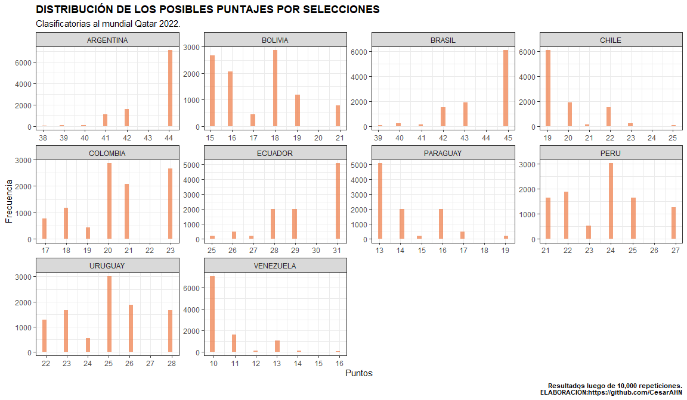

# BIENVENIDOS!!!

# PROBABILIDADES DE CLASIFICAR AL MUNDIAL QATAR 2022 - CONMEBOL

Se crea este repertorio para poder determinar las probabilidades de cada
una de las selecciones de la CONMEBOL, para clasificar al mundial Qatar
2022. Para tal fin, primero se crea una función que permita calcular los
resultados posibles de los partidos (goles a favor, goles en contra,
diferencia de goles, puntos y puesto), desde la fecha 15 a la fecha 18.

Una vez que se obtiene la función se realiza un proceso montecarlo con
el cual se evalúa la función 10,000 veces de cada compromiso de estas
cuatro fechas. Con lo cual se obtiene 10,000 resultados posibles por
cada partido.

Al final se calcula las probabilidades en función a los resultados
posibles que se obtendrían en la fecha 18 de las clasificatorias.

USted encuentra todo el código en este repositorio, el archivo se llama
**script-probabilidades-qatar-2022.R**

## Tabla de posiciones.

Se obtendrá la tabla de posiciones dese la web de espn, actualizado a la
fecha 2022-01-03. Para esto se usa el método de web scraping.

``` r
tab_pos %>% as_tibble() %>% gt() %>%
  gt_theme_espn() %>% tab_header(title = "TABLA DE POSICIONES CONMEBOL - FECHA 14.",
             subtitle = "Clasificatorias al mundial Qatar 2022.")
```

<div id="qsztnaaqxu" style="overflow-x:auto;overflow-y:auto;width:auto;height:auto;">
<style>@import url("https://fonts.googleapis.com/css2?family=Lato:ital,wght@0,100;0,200;0,300;0,400;0,500;0,600;0,700;0,800;0,900;1,100;1,200;1,300;1,400;1,500;1,600;1,700;1,800;1,900&display=swap");
html {
  font-family: Lato, -apple-system, BlinkMacSystemFont, 'Segoe UI', Roboto, Oxygen, Ubuntu, Cantarell, 'Helvetica Neue', 'Fira Sans', 'Droid Sans', Arial, sans-serif;
}

#qsztnaaqxu .gt_table {
  display: table;
  border-collapse: collapse;
  margin-left: auto;
  margin-right: auto;
  color: #333333;
  font-size: 16px;
  font-weight: normal;
  font-style: normal;
  background-color: #FFFFFF;
  width: auto;
  border-top-style: solid;
  border-top-width: 3px;
  border-top-color: #FFFFFF;
  border-right-style: none;
  border-right-width: 2px;
  border-right-color: #D3D3D3;
  border-bottom-style: solid;
  border-bottom-width: 2px;
  border-bottom-color: #A8A8A8;
  border-left-style: none;
  border-left-width: 2px;
  border-left-color: #D3D3D3;
}

#qsztnaaqxu .gt_heading {
  background-color: #FFFFFF;
  text-align: left;
  border-bottom-color: #FFFFFF;
  border-left-style: none;
  border-left-width: 1px;
  border-left-color: #D3D3D3;
  border-right-style: none;
  border-right-width: 1px;
  border-right-color: #D3D3D3;
}

#qsztnaaqxu .gt_title {
  color: #333333;
  font-size: 24px;
  font-weight: initial;
  padding-top: 4px;
  padding-bottom: 4px;
  border-bottom-color: #FFFFFF;
  border-bottom-width: 0;
}

#qsztnaaqxu .gt_subtitle {
  color: #333333;
  font-size: 85%;
  font-weight: initial;
  padding-top: 0;
  padding-bottom: 6px;
  border-top-color: #FFFFFF;
  border-top-width: 0;
}

#qsztnaaqxu .gt_bottom_border {
  border-bottom-style: solid;
  border-bottom-width: 2px;
  border-bottom-color: #D3D3D3;
}

#qsztnaaqxu .gt_col_headings {
  border-top-style: solid;
  border-top-width: 2px;
  border-top-color: #D3D3D3;
  border-bottom-style: solid;
  border-bottom-width: 2px;
  border-bottom-color: #D3D3D3;
  border-left-style: none;
  border-left-width: 1px;
  border-left-color: #D3D3D3;
  border-right-style: none;
  border-right-width: 1px;
  border-right-color: #D3D3D3;
}

#qsztnaaqxu .gt_col_heading {
  color: #333333;
  background-color: #FFFFFF;
  font-size: 80%;
  font-weight: bolder;
  text-transform: uppercase;
  border-left-style: none;
  border-left-width: 1px;
  border-left-color: #D3D3D3;
  border-right-style: none;
  border-right-width: 1px;
  border-right-color: #D3D3D3;
  vertical-align: bottom;
  padding-top: 5px;
  padding-bottom: 6px;
  padding-left: 5px;
  padding-right: 5px;
  overflow-x: hidden;
}

#qsztnaaqxu .gt_column_spanner_outer {
  color: #333333;
  background-color: #FFFFFF;
  font-size: 80%;
  font-weight: bolder;
  text-transform: uppercase;
  padding-top: 0;
  padding-bottom: 0;
  padding-left: 4px;
  padding-right: 4px;
}

#qsztnaaqxu .gt_column_spanner_outer:first-child {
  padding-left: 0;
}

#qsztnaaqxu .gt_column_spanner_outer:last-child {
  padding-right: 0;
}

#qsztnaaqxu .gt_column_spanner {
  border-bottom-style: solid;
  border-bottom-width: 2px;
  border-bottom-color: #D3D3D3;
  vertical-align: bottom;
  padding-top: 5px;
  padding-bottom: 5px;
  overflow-x: hidden;
  display: inline-block;
  width: 100%;
}

#qsztnaaqxu .gt_group_heading {
  padding: 8px;
  color: #333333;
  background-color: #FFFFFF;
  font-size: 80%;
  font-weight: bolder;
  text-transform: uppercase;
  border-top-style: solid;
  border-top-width: 2px;
  border-top-color: #D3D3D3;
  border-bottom-style: solid;
  border-bottom-width: 2px;
  border-bottom-color: #D3D3D3;
  border-left-style: none;
  border-left-width: 1px;
  border-left-color: #D3D3D3;
  border-right-style: none;
  border-right-width: 1px;
  border-right-color: #D3D3D3;
  vertical-align: middle;
}

#qsztnaaqxu .gt_empty_group_heading {
  padding: 0.5px;
  color: #333333;
  background-color: #FFFFFF;
  font-size: 80%;
  font-weight: bolder;
  border-top-style: solid;
  border-top-width: 2px;
  border-top-color: #D3D3D3;
  border-bottom-style: solid;
  border-bottom-width: 2px;
  border-bottom-color: #D3D3D3;
  vertical-align: middle;
}

#qsztnaaqxu .gt_from_md > :first-child {
  margin-top: 0;
}

#qsztnaaqxu .gt_from_md > :last-child {
  margin-bottom: 0;
}

#qsztnaaqxu .gt_row {
  padding-top: 7px;
  padding-bottom: 7px;
  padding-left: 5px;
  padding-right: 5px;
  margin: 10px;
  border-top-style: solid;
  border-top-width: 1px;
  border-top-color: #F6F7F7;
  border-left-style: none;
  border-left-width: 1px;
  border-left-color: #D3D3D3;
  border-right-style: none;
  border-right-width: 1px;
  border-right-color: #D3D3D3;
  vertical-align: middle;
  overflow-x: hidden;
}

#qsztnaaqxu .gt_stub {
  color: #333333;
  background-color: #FFFFFF;
  font-size: 80%;
  font-weight: bolder;
  text-transform: uppercase;
  border-right-style: solid;
  border-right-width: 2px;
  border-right-color: #D3D3D3;
  padding-left: 12px;
}

#qsztnaaqxu .gt_summary_row {
  color: #333333;
  background-color: #FFFFFF;
  text-transform: inherit;
  padding-top: 8px;
  padding-bottom: 8px;
  padding-left: 5px;
  padding-right: 5px;
}

#qsztnaaqxu .gt_first_summary_row {
  padding-top: 8px;
  padding-bottom: 8px;
  padding-left: 5px;
  padding-right: 5px;
  border-top-style: solid;
  border-top-width: 2px;
  border-top-color: #D3D3D3;
}

#qsztnaaqxu .gt_grand_summary_row {
  color: #333333;
  background-color: #FFFFFF;
  text-transform: inherit;
  padding-top: 8px;
  padding-bottom: 8px;
  padding-left: 5px;
  padding-right: 5px;
}

#qsztnaaqxu .gt_first_grand_summary_row {
  padding-top: 8px;
  padding-bottom: 8px;
  padding-left: 5px;
  padding-right: 5px;
  border-top-style: double;
  border-top-width: 6px;
  border-top-color: #D3D3D3;
}

#qsztnaaqxu .gt_striped {
  background-color: #FAFAFA;
}

#qsztnaaqxu .gt_table_body {
  border-top-style: solid;
  border-top-width: 2px;
  border-top-color: #D3D3D3;
  border-bottom-style: solid;
  border-bottom-width: 2px;
  border-bottom-color: #D3D3D3;
}

#qsztnaaqxu .gt_footnotes {
  color: #333333;
  background-color: #FFFFFF;
  border-bottom-style: none;
  border-bottom-width: 2px;
  border-bottom-color: #D3D3D3;
  border-left-style: none;
  border-left-width: 2px;
  border-left-color: #D3D3D3;
  border-right-style: none;
  border-right-width: 2px;
  border-right-color: #D3D3D3;
}

#qsztnaaqxu .gt_footnote {
  margin: 0px;
  font-size: 90%;
  padding: 4px;
}

#qsztnaaqxu .gt_sourcenotes {
  color: #333333;
  background-color: #FFFFFF;
  border-bottom-style: none;
  border-bottom-width: 2px;
  border-bottom-color: #D3D3D3;
  border-left-style: none;
  border-left-width: 2px;
  border-left-color: #D3D3D3;
  border-right-style: none;
  border-right-width: 2px;
  border-right-color: #D3D3D3;
}

#qsztnaaqxu .gt_sourcenote {
  font-size: 12px;
  padding: 4px;
}

#qsztnaaqxu .gt_left {
  text-align: left;
}

#qsztnaaqxu .gt_center {
  text-align: center;
}

#qsztnaaqxu .gt_right {
  text-align: right;
  font-variant-numeric: tabular-nums;
}

#qsztnaaqxu .gt_font_normal {
  font-weight: normal;
}

#qsztnaaqxu .gt_font_bold {
  font-weight: bold;
}

#qsztnaaqxu .gt_font_italic {
  font-style: italic;
}

#qsztnaaqxu .gt_super {
  font-size: 65%;
}

#qsztnaaqxu .gt_footnote_marks {
  font-style: italic;
  font-weight: normal;
  font-size: 65%;
}
</style>
<table class="gt_table">
  <thead class="gt_header">
    <tr>
      <th colspan="9" class="gt_heading gt_title gt_font_normal" style>TABLA DE POSICIONES CONMEBOL - FECHA 14.</th>
    </tr>
    <tr>
      <th colspan="9" class="gt_heading gt_subtitle gt_font_normal gt_bottom_border" style>Clasificatorias al mundial Qatar 2022.</th>
    </tr>
  </thead>
  <thead class="gt_col_headings">
    <tr>
      <th class="gt_col_heading gt_columns_bottom_border gt_left" rowspan="1" colspan="1">SELECCION</th>
      <th class="gt_col_heading gt_columns_bottom_border gt_right" rowspan="1" colspan="1">J</th>
      <th class="gt_col_heading gt_columns_bottom_border gt_right" rowspan="1" colspan="1">G</th>
      <th class="gt_col_heading gt_columns_bottom_border gt_right" rowspan="1" colspan="1">E</th>
      <th class="gt_col_heading gt_columns_bottom_border gt_right" rowspan="1" colspan="1">P</th>
      <th class="gt_col_heading gt_columns_bottom_border gt_right" rowspan="1" colspan="1">GF</th>
      <th class="gt_col_heading gt_columns_bottom_border gt_right" rowspan="1" colspan="1">GC</th>
      <th class="gt_col_heading gt_columns_bottom_border gt_right" rowspan="1" colspan="1">DIF</th>
      <th class="gt_col_heading gt_columns_bottom_border gt_right" rowspan="1" colspan="1">PTS</th>
    </tr>
  </thead>
  <tbody class="gt_table_body">
    <tr><td class="gt_row gt_left">BRASIL</td>
<td class="gt_row gt_right">13</td>
<td class="gt_row gt_right">11</td>
<td class="gt_row gt_right">2</td>
<td class="gt_row gt_right">0</td>
<td class="gt_row gt_right">27</td>
<td class="gt_row gt_right">4</td>
<td class="gt_row gt_right">23</td>
<td class="gt_row gt_right">35</td></tr>
    <tr><td class="gt_row gt_left gt_striped">ARGENTINA</td>
<td class="gt_row gt_right gt_striped">13</td>
<td class="gt_row gt_right gt_striped">8</td>
<td class="gt_row gt_right gt_striped">5</td>
<td class="gt_row gt_right gt_striped">0</td>
<td class="gt_row gt_right gt_striped">20</td>
<td class="gt_row gt_right gt_striped">6</td>
<td class="gt_row gt_right gt_striped">14</td>
<td class="gt_row gt_right gt_striped">29</td></tr>
    <tr><td class="gt_row gt_left">ECUADOR</td>
<td class="gt_row gt_right">14</td>
<td class="gt_row gt_right">7</td>
<td class="gt_row gt_right">2</td>
<td class="gt_row gt_right">5</td>
<td class="gt_row gt_right">23</td>
<td class="gt_row gt_right">13</td>
<td class="gt_row gt_right">10</td>
<td class="gt_row gt_right">23</td></tr>
    <tr><td class="gt_row gt_left gt_striped">COLOMBIA</td>
<td class="gt_row gt_right gt_striped">14</td>
<td class="gt_row gt_right gt_striped">3</td>
<td class="gt_row gt_right gt_striped">8</td>
<td class="gt_row gt_right gt_striped">3</td>
<td class="gt_row gt_right gt_striped">16</td>
<td class="gt_row gt_right gt_striped">17</td>
<td class="gt_row gt_right gt_striped">-1</td>
<td class="gt_row gt_right gt_striped">17</td></tr>
    <tr><td class="gt_row gt_left">PERU</td>
<td class="gt_row gt_right">14</td>
<td class="gt_row gt_right">5</td>
<td class="gt_row gt_right">2</td>
<td class="gt_row gt_right">7</td>
<td class="gt_row gt_right">15</td>
<td class="gt_row gt_right">20</td>
<td class="gt_row gt_right">-5</td>
<td class="gt_row gt_right">17</td></tr>
    <tr><td class="gt_row gt_left gt_striped">CHILE</td>
<td class="gt_row gt_right gt_striped">14</td>
<td class="gt_row gt_right gt_striped">4</td>
<td class="gt_row gt_right gt_striped">4</td>
<td class="gt_row gt_right gt_striped">6</td>
<td class="gt_row gt_right gt_striped">15</td>
<td class="gt_row gt_right gt_striped">16</td>
<td class="gt_row gt_right gt_striped">-1</td>
<td class="gt_row gt_right gt_striped">16</td></tr>
    <tr><td class="gt_row gt_left">URUGUAY</td>
<td class="gt_row gt_right">14</td>
<td class="gt_row gt_right">4</td>
<td class="gt_row gt_right">4</td>
<td class="gt_row gt_right">6</td>
<td class="gt_row gt_right">14</td>
<td class="gt_row gt_right">21</td>
<td class="gt_row gt_right">-7</td>
<td class="gt_row gt_right">16</td></tr>
    <tr><td class="gt_row gt_left gt_striped">BOLIVIA</td>
<td class="gt_row gt_right gt_striped">14</td>
<td class="gt_row gt_right gt_striped">4</td>
<td class="gt_row gt_right gt_striped">3</td>
<td class="gt_row gt_right gt_striped">7</td>
<td class="gt_row gt_right gt_striped">20</td>
<td class="gt_row gt_right gt_striped">28</td>
<td class="gt_row gt_right gt_striped">-8</td>
<td class="gt_row gt_right gt_striped">15</td></tr>
    <tr><td class="gt_row gt_left">PARAGUAY</td>
<td class="gt_row gt_right">14</td>
<td class="gt_row gt_right">2</td>
<td class="gt_row gt_right">7</td>
<td class="gt_row gt_right">5</td>
<td class="gt_row gt_right">9</td>
<td class="gt_row gt_right">18</td>
<td class="gt_row gt_right">-9</td>
<td class="gt_row gt_right">13</td></tr>
    <tr><td class="gt_row gt_left gt_striped">VENEZUELA</td>
<td class="gt_row gt_right gt_striped">14</td>
<td class="gt_row gt_right gt_striped">2</td>
<td class="gt_row gt_right gt_striped">1</td>
<td class="gt_row gt_right gt_striped">11</td>
<td class="gt_row gt_right gt_striped">9</td>
<td class="gt_row gt_right gt_striped">25</td>
<td class="gt_row gt_right gt_striped">-16</td>
<td class="gt_row gt_right gt_striped">7</td></tr>
  </tbody>
  
  
</table>
</div>

Hasta la fecha 14, se tiene pendiente el partido entre Brasil y
Argentina. Para el cálculo se supondrá que la selección de Argentina
gana este partido por una diferencia de 3 a 0, como se da en los casos
de walkover. Por lo cual la tabla de posiciones quedaría:

``` r
tab_pos %>% as_tibble() %>% gt() %>%
  gt_theme_espn() %>% tab_header(title = "TABLA DE POSICIONES CONMEBOL - FECHA 14.",
             subtitle = "Clasificatorias al mundial Qatar 2022.") %>% 
  tab_source_note("En el supuesto de que Brasil pierda por 3 a 0 contra argentina (Partido pendiente).")
```

<div id="zddjqwuuar" style="overflow-x:auto;overflow-y:auto;width:auto;height:auto;">
<style>@import url("https://fonts.googleapis.com/css2?family=Lato:ital,wght@0,100;0,200;0,300;0,400;0,500;0,600;0,700;0,800;0,900;1,100;1,200;1,300;1,400;1,500;1,600;1,700;1,800;1,900&display=swap");
html {
  font-family: Lato, -apple-system, BlinkMacSystemFont, 'Segoe UI', Roboto, Oxygen, Ubuntu, Cantarell, 'Helvetica Neue', 'Fira Sans', 'Droid Sans', Arial, sans-serif;
}

#zddjqwuuar .gt_table {
  display: table;
  border-collapse: collapse;
  margin-left: auto;
  margin-right: auto;
  color: #333333;
  font-size: 16px;
  font-weight: normal;
  font-style: normal;
  background-color: #FFFFFF;
  width: auto;
  border-top-style: solid;
  border-top-width: 3px;
  border-top-color: #FFFFFF;
  border-right-style: none;
  border-right-width: 2px;
  border-right-color: #D3D3D3;
  border-bottom-style: solid;
  border-bottom-width: 2px;
  border-bottom-color: #A8A8A8;
  border-left-style: none;
  border-left-width: 2px;
  border-left-color: #D3D3D3;
}

#zddjqwuuar .gt_heading {
  background-color: #FFFFFF;
  text-align: left;
  border-bottom-color: #FFFFFF;
  border-left-style: none;
  border-left-width: 1px;
  border-left-color: #D3D3D3;
  border-right-style: none;
  border-right-width: 1px;
  border-right-color: #D3D3D3;
}

#zddjqwuuar .gt_title {
  color: #333333;
  font-size: 24px;
  font-weight: initial;
  padding-top: 4px;
  padding-bottom: 4px;
  border-bottom-color: #FFFFFF;
  border-bottom-width: 0;
}

#zddjqwuuar .gt_subtitle {
  color: #333333;
  font-size: 85%;
  font-weight: initial;
  padding-top: 0;
  padding-bottom: 6px;
  border-top-color: #FFFFFF;
  border-top-width: 0;
}

#zddjqwuuar .gt_bottom_border {
  border-bottom-style: solid;
  border-bottom-width: 2px;
  border-bottom-color: #D3D3D3;
}

#zddjqwuuar .gt_col_headings {
  border-top-style: solid;
  border-top-width: 2px;
  border-top-color: #D3D3D3;
  border-bottom-style: solid;
  border-bottom-width: 2px;
  border-bottom-color: #D3D3D3;
  border-left-style: none;
  border-left-width: 1px;
  border-left-color: #D3D3D3;
  border-right-style: none;
  border-right-width: 1px;
  border-right-color: #D3D3D3;
}

#zddjqwuuar .gt_col_heading {
  color: #333333;
  background-color: #FFFFFF;
  font-size: 80%;
  font-weight: bolder;
  text-transform: uppercase;
  border-left-style: none;
  border-left-width: 1px;
  border-left-color: #D3D3D3;
  border-right-style: none;
  border-right-width: 1px;
  border-right-color: #D3D3D3;
  vertical-align: bottom;
  padding-top: 5px;
  padding-bottom: 6px;
  padding-left: 5px;
  padding-right: 5px;
  overflow-x: hidden;
}

#zddjqwuuar .gt_column_spanner_outer {
  color: #333333;
  background-color: #FFFFFF;
  font-size: 80%;
  font-weight: bolder;
  text-transform: uppercase;
  padding-top: 0;
  padding-bottom: 0;
  padding-left: 4px;
  padding-right: 4px;
}

#zddjqwuuar .gt_column_spanner_outer:first-child {
  padding-left: 0;
}

#zddjqwuuar .gt_column_spanner_outer:last-child {
  padding-right: 0;
}

#zddjqwuuar .gt_column_spanner {
  border-bottom-style: solid;
  border-bottom-width: 2px;
  border-bottom-color: #D3D3D3;
  vertical-align: bottom;
  padding-top: 5px;
  padding-bottom: 5px;
  overflow-x: hidden;
  display: inline-block;
  width: 100%;
}

#zddjqwuuar .gt_group_heading {
  padding: 8px;
  color: #333333;
  background-color: #FFFFFF;
  font-size: 80%;
  font-weight: bolder;
  text-transform: uppercase;
  border-top-style: solid;
  border-top-width: 2px;
  border-top-color: #D3D3D3;
  border-bottom-style: solid;
  border-bottom-width: 2px;
  border-bottom-color: #D3D3D3;
  border-left-style: none;
  border-left-width: 1px;
  border-left-color: #D3D3D3;
  border-right-style: none;
  border-right-width: 1px;
  border-right-color: #D3D3D3;
  vertical-align: middle;
}

#zddjqwuuar .gt_empty_group_heading {
  padding: 0.5px;
  color: #333333;
  background-color: #FFFFFF;
  font-size: 80%;
  font-weight: bolder;
  border-top-style: solid;
  border-top-width: 2px;
  border-top-color: #D3D3D3;
  border-bottom-style: solid;
  border-bottom-width: 2px;
  border-bottom-color: #D3D3D3;
  vertical-align: middle;
}

#zddjqwuuar .gt_from_md > :first-child {
  margin-top: 0;
}

#zddjqwuuar .gt_from_md > :last-child {
  margin-bottom: 0;
}

#zddjqwuuar .gt_row {
  padding-top: 7px;
  padding-bottom: 7px;
  padding-left: 5px;
  padding-right: 5px;
  margin: 10px;
  border-top-style: solid;
  border-top-width: 1px;
  border-top-color: #F6F7F7;
  border-left-style: none;
  border-left-width: 1px;
  border-left-color: #D3D3D3;
  border-right-style: none;
  border-right-width: 1px;
  border-right-color: #D3D3D3;
  vertical-align: middle;
  overflow-x: hidden;
}

#zddjqwuuar .gt_stub {
  color: #333333;
  background-color: #FFFFFF;
  font-size: 80%;
  font-weight: bolder;
  text-transform: uppercase;
  border-right-style: solid;
  border-right-width: 2px;
  border-right-color: #D3D3D3;
  padding-left: 12px;
}

#zddjqwuuar .gt_summary_row {
  color: #333333;
  background-color: #FFFFFF;
  text-transform: inherit;
  padding-top: 8px;
  padding-bottom: 8px;
  padding-left: 5px;
  padding-right: 5px;
}

#zddjqwuuar .gt_first_summary_row {
  padding-top: 8px;
  padding-bottom: 8px;
  padding-left: 5px;
  padding-right: 5px;
  border-top-style: solid;
  border-top-width: 2px;
  border-top-color: #D3D3D3;
}

#zddjqwuuar .gt_grand_summary_row {
  color: #333333;
  background-color: #FFFFFF;
  text-transform: inherit;
  padding-top: 8px;
  padding-bottom: 8px;
  padding-left: 5px;
  padding-right: 5px;
}

#zddjqwuuar .gt_first_grand_summary_row {
  padding-top: 8px;
  padding-bottom: 8px;
  padding-left: 5px;
  padding-right: 5px;
  border-top-style: double;
  border-top-width: 6px;
  border-top-color: #D3D3D3;
}

#zddjqwuuar .gt_striped {
  background-color: #FAFAFA;
}

#zddjqwuuar .gt_table_body {
  border-top-style: solid;
  border-top-width: 2px;
  border-top-color: #D3D3D3;
  border-bottom-style: solid;
  border-bottom-width: 2px;
  border-bottom-color: #D3D3D3;
}

#zddjqwuuar .gt_footnotes {
  color: #333333;
  background-color: #FFFFFF;
  border-bottom-style: none;
  border-bottom-width: 2px;
  border-bottom-color: #D3D3D3;
  border-left-style: none;
  border-left-width: 2px;
  border-left-color: #D3D3D3;
  border-right-style: none;
  border-right-width: 2px;
  border-right-color: #D3D3D3;
}

#zddjqwuuar .gt_footnote {
  margin: 0px;
  font-size: 90%;
  padding: 4px;
}

#zddjqwuuar .gt_sourcenotes {
  color: #333333;
  background-color: #FFFFFF;
  border-bottom-style: none;
  border-bottom-width: 2px;
  border-bottom-color: #D3D3D3;
  border-left-style: none;
  border-left-width: 2px;
  border-left-color: #D3D3D3;
  border-right-style: none;
  border-right-width: 2px;
  border-right-color: #D3D3D3;
}

#zddjqwuuar .gt_sourcenote {
  font-size: 12px;
  padding: 4px;
}

#zddjqwuuar .gt_left {
  text-align: left;
}

#zddjqwuuar .gt_center {
  text-align: center;
}

#zddjqwuuar .gt_right {
  text-align: right;
  font-variant-numeric: tabular-nums;
}

#zddjqwuuar .gt_font_normal {
  font-weight: normal;
}

#zddjqwuuar .gt_font_bold {
  font-weight: bold;
}

#zddjqwuuar .gt_font_italic {
  font-style: italic;
}

#zddjqwuuar .gt_super {
  font-size: 65%;
}

#zddjqwuuar .gt_footnote_marks {
  font-style: italic;
  font-weight: normal;
  font-size: 65%;
}
</style>
<table class="gt_table">
  <thead class="gt_header">
    <tr>
      <th colspan="9" class="gt_heading gt_title gt_font_normal" style>TABLA DE POSICIONES CONMEBOL - FECHA 14.</th>
    </tr>
    <tr>
      <th colspan="9" class="gt_heading gt_subtitle gt_font_normal gt_bottom_border" style>Clasificatorias al mundial Qatar 2022.</th>
    </tr>
  </thead>
  <thead class="gt_col_headings">
    <tr>
      <th class="gt_col_heading gt_columns_bottom_border gt_left" rowspan="1" colspan="1">SELECCION</th>
      <th class="gt_col_heading gt_columns_bottom_border gt_right" rowspan="1" colspan="1">J</th>
      <th class="gt_col_heading gt_columns_bottom_border gt_right" rowspan="1" colspan="1">G</th>
      <th class="gt_col_heading gt_columns_bottom_border gt_right" rowspan="1" colspan="1">E</th>
      <th class="gt_col_heading gt_columns_bottom_border gt_right" rowspan="1" colspan="1">P</th>
      <th class="gt_col_heading gt_columns_bottom_border gt_right" rowspan="1" colspan="1">GF</th>
      <th class="gt_col_heading gt_columns_bottom_border gt_right" rowspan="1" colspan="1">GC</th>
      <th class="gt_col_heading gt_columns_bottom_border gt_right" rowspan="1" colspan="1">DIF</th>
      <th class="gt_col_heading gt_columns_bottom_border gt_right" rowspan="1" colspan="1">PTS</th>
    </tr>
  </thead>
  <tbody class="gt_table_body">
    <tr><td class="gt_row gt_left">BRASIL</td>
<td class="gt_row gt_right">14</td>
<td class="gt_row gt_right">11</td>
<td class="gt_row gt_right">2</td>
<td class="gt_row gt_right">1</td>
<td class="gt_row gt_right">27</td>
<td class="gt_row gt_right">7</td>
<td class="gt_row gt_right">20</td>
<td class="gt_row gt_right">35</td></tr>
    <tr><td class="gt_row gt_left gt_striped">ARGENTINA</td>
<td class="gt_row gt_right gt_striped">14</td>
<td class="gt_row gt_right gt_striped">9</td>
<td class="gt_row gt_right gt_striped">5</td>
<td class="gt_row gt_right gt_striped">0</td>
<td class="gt_row gt_right gt_striped">23</td>
<td class="gt_row gt_right gt_striped">6</td>
<td class="gt_row gt_right gt_striped">17</td>
<td class="gt_row gt_right gt_striped">32</td></tr>
    <tr><td class="gt_row gt_left">ECUADOR</td>
<td class="gt_row gt_right">14</td>
<td class="gt_row gt_right">7</td>
<td class="gt_row gt_right">2</td>
<td class="gt_row gt_right">5</td>
<td class="gt_row gt_right">23</td>
<td class="gt_row gt_right">13</td>
<td class="gt_row gt_right">10</td>
<td class="gt_row gt_right">23</td></tr>
    <tr><td class="gt_row gt_left gt_striped">COLOMBIA</td>
<td class="gt_row gt_right gt_striped">14</td>
<td class="gt_row gt_right gt_striped">3</td>
<td class="gt_row gt_right gt_striped">8</td>
<td class="gt_row gt_right gt_striped">3</td>
<td class="gt_row gt_right gt_striped">16</td>
<td class="gt_row gt_right gt_striped">17</td>
<td class="gt_row gt_right gt_striped">-1</td>
<td class="gt_row gt_right gt_striped">17</td></tr>
    <tr><td class="gt_row gt_left">PERU</td>
<td class="gt_row gt_right">14</td>
<td class="gt_row gt_right">5</td>
<td class="gt_row gt_right">2</td>
<td class="gt_row gt_right">7</td>
<td class="gt_row gt_right">15</td>
<td class="gt_row gt_right">20</td>
<td class="gt_row gt_right">-5</td>
<td class="gt_row gt_right">17</td></tr>
    <tr><td class="gt_row gt_left gt_striped">CHILE</td>
<td class="gt_row gt_right gt_striped">14</td>
<td class="gt_row gt_right gt_striped">4</td>
<td class="gt_row gt_right gt_striped">4</td>
<td class="gt_row gt_right gt_striped">6</td>
<td class="gt_row gt_right gt_striped">15</td>
<td class="gt_row gt_right gt_striped">16</td>
<td class="gt_row gt_right gt_striped">-1</td>
<td class="gt_row gt_right gt_striped">16</td></tr>
    <tr><td class="gt_row gt_left">URUGUAY</td>
<td class="gt_row gt_right">14</td>
<td class="gt_row gt_right">4</td>
<td class="gt_row gt_right">4</td>
<td class="gt_row gt_right">6</td>
<td class="gt_row gt_right">14</td>
<td class="gt_row gt_right">21</td>
<td class="gt_row gt_right">-7</td>
<td class="gt_row gt_right">16</td></tr>
    <tr><td class="gt_row gt_left gt_striped">BOLIVIA</td>
<td class="gt_row gt_right gt_striped">14</td>
<td class="gt_row gt_right gt_striped">4</td>
<td class="gt_row gt_right gt_striped">3</td>
<td class="gt_row gt_right gt_striped">7</td>
<td class="gt_row gt_right gt_striped">20</td>
<td class="gt_row gt_right gt_striped">28</td>
<td class="gt_row gt_right gt_striped">-8</td>
<td class="gt_row gt_right gt_striped">15</td></tr>
    <tr><td class="gt_row gt_left">PARAGUAY</td>
<td class="gt_row gt_right">14</td>
<td class="gt_row gt_right">2</td>
<td class="gt_row gt_right">7</td>
<td class="gt_row gt_right">5</td>
<td class="gt_row gt_right">9</td>
<td class="gt_row gt_right">18</td>
<td class="gt_row gt_right">-9</td>
<td class="gt_row gt_right">13</td></tr>
    <tr><td class="gt_row gt_left gt_striped">VENEZUELA</td>
<td class="gt_row gt_right gt_striped">14</td>
<td class="gt_row gt_right gt_striped">2</td>
<td class="gt_row gt_right gt_striped">1</td>
<td class="gt_row gt_right gt_striped">11</td>
<td class="gt_row gt_right gt_striped">9</td>
<td class="gt_row gt_right gt_striped">25</td>
<td class="gt_row gt_right gt_striped">-16</td>
<td class="gt_row gt_right gt_striped">7</td></tr>
  </tbody>
  <tfoot class="gt_sourcenotes">
    <tr>
      <td class="gt_sourcenote" colspan="9">En el supuesto de que Brasil pierda por 3 a 0 contra argentina (Partido pendiente).</td>
    </tr>
  </tfoot>
  
</table>
</div>

## Desempeño de las selecciones.

Todos los países no tienen el mismo desempeño, por lo cual se crea un
tipo de índice de desempeño en donde se consideran 3 características: el
puntaje de desempeño como visitante, el puntaje de desempeño como local
y el puntaje de desempeño dado por un especialista. Estas
características reciben puntajes desde 1 hasta 10, en donde 1 significa
que la selección tiene un desempeño paupérrimo, mientras que 10
significa que su desempeño es sobresaliente.

Los tres puntajes son arbitrarios ya que el desempeño de partidos
pasados no es indicador del desempeño futuro de una selección, por más
objetivo que se piense que es, ya que, las selecciones juegan partidos
luego de un lapso largo de tiempo lo cual influye en su desempeño. Por
lo cual, solo se podría indicar que tan buenos son de visita (primera
caracter´sitica), o que tan buenos son de locales (segunda
característica) y su momento actual (tercera característica).

En ese sentido los puntajes lo he asignado en función a mis
conocimientos deportivos. Usted puede asignar otros puntajes y obtendrá
resultados distintos, pero es importante no perder la objetividad.

A continuación muestro el puntaje para cada una de las selecciones como
el ratio de juego de visita y local. El ratio de visita es la suma del
desempeño de visita y la situación actual entre el puntaje máximo 20, de
manera similar se obtiene para el ratio de local.

``` r
pp %>% as_tibble() %>% gt() %>%
  gt_theme_espn() %>% tab_header(title = "ÍNDICE DE DESEMPEÑO DE LOCAL Y VISITANTE PARA CADA UNA DE LAS SELECCIONES", subtitle = "Visita, Local y Situación actual") %>% 
  tab_source_note("p1=Desempeño Visita.\np2=Desempeño Local.\np3=Desempeño Actual.")
```

<div id="glgkxpypgl" style="overflow-x:auto;overflow-y:auto;width:auto;height:auto;">
<style>@import url("https://fonts.googleapis.com/css2?family=Lato:ital,wght@0,100;0,200;0,300;0,400;0,500;0,600;0,700;0,800;0,900;1,100;1,200;1,300;1,400;1,500;1,600;1,700;1,800;1,900&display=swap");
html {
  font-family: Lato, -apple-system, BlinkMacSystemFont, 'Segoe UI', Roboto, Oxygen, Ubuntu, Cantarell, 'Helvetica Neue', 'Fira Sans', 'Droid Sans', Arial, sans-serif;
}

#glgkxpypgl .gt_table {
  display: table;
  border-collapse: collapse;
  margin-left: auto;
  margin-right: auto;
  color: #333333;
  font-size: 16px;
  font-weight: normal;
  font-style: normal;
  background-color: #FFFFFF;
  width: auto;
  border-top-style: solid;
  border-top-width: 3px;
  border-top-color: #FFFFFF;
  border-right-style: none;
  border-right-width: 2px;
  border-right-color: #D3D3D3;
  border-bottom-style: solid;
  border-bottom-width: 2px;
  border-bottom-color: #A8A8A8;
  border-left-style: none;
  border-left-width: 2px;
  border-left-color: #D3D3D3;
}

#glgkxpypgl .gt_heading {
  background-color: #FFFFFF;
  text-align: left;
  border-bottom-color: #FFFFFF;
  border-left-style: none;
  border-left-width: 1px;
  border-left-color: #D3D3D3;
  border-right-style: none;
  border-right-width: 1px;
  border-right-color: #D3D3D3;
}

#glgkxpypgl .gt_title {
  color: #333333;
  font-size: 24px;
  font-weight: initial;
  padding-top: 4px;
  padding-bottom: 4px;
  border-bottom-color: #FFFFFF;
  border-bottom-width: 0;
}

#glgkxpypgl .gt_subtitle {
  color: #333333;
  font-size: 85%;
  font-weight: initial;
  padding-top: 0;
  padding-bottom: 6px;
  border-top-color: #FFFFFF;
  border-top-width: 0;
}

#glgkxpypgl .gt_bottom_border {
  border-bottom-style: solid;
  border-bottom-width: 2px;
  border-bottom-color: #D3D3D3;
}

#glgkxpypgl .gt_col_headings {
  border-top-style: solid;
  border-top-width: 2px;
  border-top-color: #D3D3D3;
  border-bottom-style: solid;
  border-bottom-width: 2px;
  border-bottom-color: #D3D3D3;
  border-left-style: none;
  border-left-width: 1px;
  border-left-color: #D3D3D3;
  border-right-style: none;
  border-right-width: 1px;
  border-right-color: #D3D3D3;
}

#glgkxpypgl .gt_col_heading {
  color: #333333;
  background-color: #FFFFFF;
  font-size: 80%;
  font-weight: bolder;
  text-transform: uppercase;
  border-left-style: none;
  border-left-width: 1px;
  border-left-color: #D3D3D3;
  border-right-style: none;
  border-right-width: 1px;
  border-right-color: #D3D3D3;
  vertical-align: bottom;
  padding-top: 5px;
  padding-bottom: 6px;
  padding-left: 5px;
  padding-right: 5px;
  overflow-x: hidden;
}

#glgkxpypgl .gt_column_spanner_outer {
  color: #333333;
  background-color: #FFFFFF;
  font-size: 80%;
  font-weight: bolder;
  text-transform: uppercase;
  padding-top: 0;
  padding-bottom: 0;
  padding-left: 4px;
  padding-right: 4px;
}

#glgkxpypgl .gt_column_spanner_outer:first-child {
  padding-left: 0;
}

#glgkxpypgl .gt_column_spanner_outer:last-child {
  padding-right: 0;
}

#glgkxpypgl .gt_column_spanner {
  border-bottom-style: solid;
  border-bottom-width: 2px;
  border-bottom-color: #D3D3D3;
  vertical-align: bottom;
  padding-top: 5px;
  padding-bottom: 5px;
  overflow-x: hidden;
  display: inline-block;
  width: 100%;
}

#glgkxpypgl .gt_group_heading {
  padding: 8px;
  color: #333333;
  background-color: #FFFFFF;
  font-size: 80%;
  font-weight: bolder;
  text-transform: uppercase;
  border-top-style: solid;
  border-top-width: 2px;
  border-top-color: #D3D3D3;
  border-bottom-style: solid;
  border-bottom-width: 2px;
  border-bottom-color: #D3D3D3;
  border-left-style: none;
  border-left-width: 1px;
  border-left-color: #D3D3D3;
  border-right-style: none;
  border-right-width: 1px;
  border-right-color: #D3D3D3;
  vertical-align: middle;
}

#glgkxpypgl .gt_empty_group_heading {
  padding: 0.5px;
  color: #333333;
  background-color: #FFFFFF;
  font-size: 80%;
  font-weight: bolder;
  border-top-style: solid;
  border-top-width: 2px;
  border-top-color: #D3D3D3;
  border-bottom-style: solid;
  border-bottom-width: 2px;
  border-bottom-color: #D3D3D3;
  vertical-align: middle;
}

#glgkxpypgl .gt_from_md > :first-child {
  margin-top: 0;
}

#glgkxpypgl .gt_from_md > :last-child {
  margin-bottom: 0;
}

#glgkxpypgl .gt_row {
  padding-top: 7px;
  padding-bottom: 7px;
  padding-left: 5px;
  padding-right: 5px;
  margin: 10px;
  border-top-style: solid;
  border-top-width: 1px;
  border-top-color: #F6F7F7;
  border-left-style: none;
  border-left-width: 1px;
  border-left-color: #D3D3D3;
  border-right-style: none;
  border-right-width: 1px;
  border-right-color: #D3D3D3;
  vertical-align: middle;
  overflow-x: hidden;
}

#glgkxpypgl .gt_stub {
  color: #333333;
  background-color: #FFFFFF;
  font-size: 80%;
  font-weight: bolder;
  text-transform: uppercase;
  border-right-style: solid;
  border-right-width: 2px;
  border-right-color: #D3D3D3;
  padding-left: 12px;
}

#glgkxpypgl .gt_summary_row {
  color: #333333;
  background-color: #FFFFFF;
  text-transform: inherit;
  padding-top: 8px;
  padding-bottom: 8px;
  padding-left: 5px;
  padding-right: 5px;
}

#glgkxpypgl .gt_first_summary_row {
  padding-top: 8px;
  padding-bottom: 8px;
  padding-left: 5px;
  padding-right: 5px;
  border-top-style: solid;
  border-top-width: 2px;
  border-top-color: #D3D3D3;
}

#glgkxpypgl .gt_grand_summary_row {
  color: #333333;
  background-color: #FFFFFF;
  text-transform: inherit;
  padding-top: 8px;
  padding-bottom: 8px;
  padding-left: 5px;
  padding-right: 5px;
}

#glgkxpypgl .gt_first_grand_summary_row {
  padding-top: 8px;
  padding-bottom: 8px;
  padding-left: 5px;
  padding-right: 5px;
  border-top-style: double;
  border-top-width: 6px;
  border-top-color: #D3D3D3;
}

#glgkxpypgl .gt_striped {
  background-color: #FAFAFA;
}

#glgkxpypgl .gt_table_body {
  border-top-style: solid;
  border-top-width: 2px;
  border-top-color: #D3D3D3;
  border-bottom-style: solid;
  border-bottom-width: 2px;
  border-bottom-color: #D3D3D3;
}

#glgkxpypgl .gt_footnotes {
  color: #333333;
  background-color: #FFFFFF;
  border-bottom-style: none;
  border-bottom-width: 2px;
  border-bottom-color: #D3D3D3;
  border-left-style: none;
  border-left-width: 2px;
  border-left-color: #D3D3D3;
  border-right-style: none;
  border-right-width: 2px;
  border-right-color: #D3D3D3;
}

#glgkxpypgl .gt_footnote {
  margin: 0px;
  font-size: 90%;
  padding: 4px;
}

#glgkxpypgl .gt_sourcenotes {
  color: #333333;
  background-color: #FFFFFF;
  border-bottom-style: none;
  border-bottom-width: 2px;
  border-bottom-color: #D3D3D3;
  border-left-style: none;
  border-left-width: 2px;
  border-left-color: #D3D3D3;
  border-right-style: none;
  border-right-width: 2px;
  border-right-color: #D3D3D3;
}

#glgkxpypgl .gt_sourcenote {
  font-size: 12px;
  padding: 4px;
}

#glgkxpypgl .gt_left {
  text-align: left;
}

#glgkxpypgl .gt_center {
  text-align: center;
}

#glgkxpypgl .gt_right {
  text-align: right;
  font-variant-numeric: tabular-nums;
}

#glgkxpypgl .gt_font_normal {
  font-weight: normal;
}

#glgkxpypgl .gt_font_bold {
  font-weight: bold;
}

#glgkxpypgl .gt_font_italic {
  font-style: italic;
}

#glgkxpypgl .gt_super {
  font-size: 65%;
}

#glgkxpypgl .gt_footnote_marks {
  font-style: italic;
  font-weight: normal;
  font-size: 65%;
}
</style>
<table class="gt_table">
  <thead class="gt_header">
    <tr>
      <th colspan="6" class="gt_heading gt_title gt_font_normal" style>ÍNDICE DE DESEMPEÑO DE LOCAL Y VISITANTE PARA CADA UNA DE LAS SELECCIONES</th>
    </tr>
    <tr>
      <th colspan="6" class="gt_heading gt_subtitle gt_font_normal gt_bottom_border" style>Visita, Local y Situación actual</th>
    </tr>
  </thead>
  <thead class="gt_col_headings">
    <tr>
      <th class="gt_col_heading gt_columns_bottom_border gt_left" rowspan="1" colspan="1">SELECCION</th>
      <th class="gt_col_heading gt_columns_bottom_border gt_right" rowspan="1" colspan="1">p1</th>
      <th class="gt_col_heading gt_columns_bottom_border gt_right" rowspan="1" colspan="1">p2</th>
      <th class="gt_col_heading gt_columns_bottom_border gt_right" rowspan="1" colspan="1">p3</th>
      <th class="gt_col_heading gt_columns_bottom_border gt_right" rowspan="1" colspan="1">ratio_vist</th>
      <th class="gt_col_heading gt_columns_bottom_border gt_right" rowspan="1" colspan="1">ratio_loc</th>
    </tr>
  </thead>
  <tbody class="gt_table_body">
    <tr><td class="gt_row gt_left">BRASIL</td>
<td class="gt_row gt_right">9</td>
<td class="gt_row gt_right">10</td>
<td class="gt_row gt_right">9</td>
<td class="gt_row gt_right">0.90</td>
<td class="gt_row gt_right">0.95</td></tr>
    <tr><td class="gt_row gt_left gt_striped">ARGENTINA</td>
<td class="gt_row gt_right gt_striped">8</td>
<td class="gt_row gt_right gt_striped">9</td>
<td class="gt_row gt_right gt_striped">9</td>
<td class="gt_row gt_right gt_striped">0.85</td>
<td class="gt_row gt_right gt_striped">0.90</td></tr>
    <tr><td class="gt_row gt_left">ECUADOR</td>
<td class="gt_row gt_right">5</td>
<td class="gt_row gt_right">7</td>
<td class="gt_row gt_right">5</td>
<td class="gt_row gt_right">0.50</td>
<td class="gt_row gt_right">0.60</td></tr>
    <tr><td class="gt_row gt_left gt_striped">COLOMBIA</td>
<td class="gt_row gt_right gt_striped">6</td>
<td class="gt_row gt_right gt_striped">6</td>
<td class="gt_row gt_right gt_striped">6</td>
<td class="gt_row gt_right gt_striped">0.60</td>
<td class="gt_row gt_right gt_striped">0.60</td></tr>
    <tr><td class="gt_row gt_left">PERU</td>
<td class="gt_row gt_right">3</td>
<td class="gt_row gt_right">6</td>
<td class="gt_row gt_right">5</td>
<td class="gt_row gt_right">0.40</td>
<td class="gt_row gt_right">0.55</td></tr>
    <tr><td class="gt_row gt_left gt_striped">CHILE</td>
<td class="gt_row gt_right gt_striped">5</td>
<td class="gt_row gt_right gt_striped">6</td>
<td class="gt_row gt_right gt_striped">5</td>
<td class="gt_row gt_right gt_striped">0.50</td>
<td class="gt_row gt_right gt_striped">0.55</td></tr>
    <tr><td class="gt_row gt_left">URUGUAY</td>
<td class="gt_row gt_right">4</td>
<td class="gt_row gt_right">5</td>
<td class="gt_row gt_right">5</td>
<td class="gt_row gt_right">0.45</td>
<td class="gt_row gt_right">0.50</td></tr>
    <tr><td class="gt_row gt_left gt_striped">BOLIVIA</td>
<td class="gt_row gt_right gt_striped">1</td>
<td class="gt_row gt_right gt_striped">8</td>
<td class="gt_row gt_right gt_striped">4</td>
<td class="gt_row gt_right gt_striped">0.25</td>
<td class="gt_row gt_right gt_striped">0.60</td></tr>
    <tr><td class="gt_row gt_left">PARAGUAY</td>
<td class="gt_row gt_right">2</td>
<td class="gt_row gt_right">4</td>
<td class="gt_row gt_right">4</td>
<td class="gt_row gt_right">0.30</td>
<td class="gt_row gt_right">0.40</td></tr>
    <tr><td class="gt_row gt_left gt_striped">VENEZUELA</td>
<td class="gt_row gt_right gt_striped">1</td>
<td class="gt_row gt_right gt_striped">3</td>
<td class="gt_row gt_right gt_striped">2</td>
<td class="gt_row gt_right gt_striped">0.15</td>
<td class="gt_row gt_right gt_striped">0.25</td></tr>
  </tbody>
  <tfoot class="gt_sourcenotes">
    <tr>
      <td class="gt_sourcenote" colspan="6">p1=Desempeño Visita.
p2=Desempeño Local.
p3=Desempeño Actual.</td>
    </tr>
  </tfoot>
  
</table>
</div>

## Función para el cálculo de resultados.

Se crea la función que determinará el resultado de cada partidos de las
4 fechas resltantes (de la fecha 15 a la fecha 18). Esta función
considera dos argumentos: la tabla de posiciones consolidada hasta la
fecha 14 y el desempeño de las selecciones.

La función es la siguiente:

``` r
clasificatorias<-function(tab_pos,pp){
  #---------------------
  # Fecha 15.
  f15<-c("COLOMBIA","PERU","VENEZUELA","BOLIVIA","PARAGUAY",
         "URUGUAY","CHILE","ARGENTINA","ECUADOR","BRASIL")
  bd15<-data.frame()
  for (i in seq(1,9,by=2)) {
    d<-(1-(pp[pp$SELECCION==f15[i],6]-pp[pp$SELECCION==f15[i+1],5]))
    if(d<1){
      a1<-rbind(data.frame(SELECCION=f15[i], GF_=sample(0:4,1, prob = c(1*d/10,2*d/10,3*d/10,4*d/10,(1-d)))),
                data.frame(SELECCION=f15[i+1], GF_=sample(0:4,1, prob = c((1-d),5*d/14,4*d/14,3*d/14,2*d/14)))) 
    } else {
      d<-(1-(pp[pp$SELECCION==f15[i+1],6]-pp[pp$SELECCION==f15[i],5]))
      a1<-rbind(data.frame(SELECCION=f15[i+1], GF_=sample(0:4,1, prob = c(1*d/10,2*d/10,3*d/10,4*d/10,(1-d)))),
                data.frame(SELECCION=f15[i], GF_=sample(0:4,1, prob = c((1-d),5*d/14,4*d/14,3*d/14,2*d/14)))) 
    }
    a1$GC_<-rev(a1$GF_)
    a1$PTS_<-ifelse(a1$GF_>a1$GC_,3,
                    ifelse(a1$GF_==a1$GC_,1,0))
    a1$G_<-ifelse(a1$PTS_==3,1,0)
    a1$P_<-rev(a1$G_)
    a1$E_<-ifelse(a1$PTS_==1,1,0) 
    bd15<-rbind(bd15,a1)
  }
  
  tab_pos15<-left_join(tab_pos,bd15, by="SELECCION")
  
  tab_pos15<-tab_pos15 %>% mutate(J=J+1, G=G+G_, E=E+E_, P=P+P_, GF=GF+GF_, GC=GC+GC_,
                                  PTS=PTS+PTS_, DIF=GF-GC) %>% select(1:9) %>% arrange(-PTS)
  
  #---------------------
  # Fecha 16.
  f16<-c("URUGUAY","VENEZUELA","PERU","ECUADOR","BRASIL","PARAGUAY",
         "BOLIVIA","CHILE","ARGENTINA","COLOMBIA")
  bd16<-data.frame()
  for (i in seq(1,9,by=2)) {
    d<-(1-(pp[pp$SELECCION==f16[i],6]-pp[pp$SELECCION==f16[i+1],5]))
    if(d<1){
      a1<-rbind(data.frame(SELECCION=f16[i], GF_=sample(0:4,1, prob = c(1*d/10,2*d/10,3*d/10,4*d/10,(1-d)))),
                data.frame(SELECCION=f16[i+1], GF_=sample(0:4,1, prob = c((1-d),5*d/14,4*d/14,3*d/14,2*d/14)))) 
    } else {
      d<-(1-(pp[pp$SELECCION==f16[i+1],6]-pp[pp$SELECCION==f16[i],5]))
      a1<-rbind(data.frame(SELECCION=f16[i+1], GF_=sample(0:4,1, prob = c(1*d/10,2*d/10,3*d/10,4*d/10,(1-d)))),
                data.frame(SELECCION=f16[i], GF_=sample(0:4,1, prob = c((1-d),5*d/14,4*d/14,3*d/14,2*d/14)))) 
    }
    a1$GC_<-rev(a1$GF_)
    a1$PTS_<-ifelse(a1$GF_>a1$GC_,3,
                    ifelse(a1$GF_==a1$GC_,1,0))
    a1$G_<-ifelse(a1$PTS_==3,1,0)
    a1$P_<-rev(a1$G_)
    a1$E_<-ifelse(a1$PTS_==1,1,0) 
    bd16<-rbind(bd16,a1)
  }
  
  tab_pos16<-left_join(tab_pos15,bd16, by="SELECCION")
  
  tab_pos16<-tab_pos16 %>% mutate(J=J+1, G=G+G_, E=E+E_, P=P+P_, GF=GF+GF_, GC=GC+GC_,
                                  PTS=PTS+PTS_, DIF=GF-GC) %>% select(1:9) %>% arrange(-PTS)
  
  #---------------------
  # Fecha 17.
  f17<-c("URUGUAY","PERU","COLOMBIA","BOLIVIA","BRASIL","CHILE",
         "PARAGUAY","ECUADOR","ARGENTINA","VENEZUELA")
  bd17<-data.frame()
  for (i in seq(1,9,by=2)) {
    d<-(1-(pp[pp$SELECCION==f17[i],6]-pp[pp$SELECCION==f17[i+1],5]))
    if(d<1){
      a1<-rbind(data.frame(SELECCION=f17[i], GF_=sample(0:4,1, prob = c(1*d/10,2*d/10,3*d/10,4*d/10,(1-d)))),
                data.frame(SELECCION=f17[i+1], GF_=sample(0:4,1, prob = c((1-d),5*d/14,4*d/14,3*d/14,2*d/14)))) 
    } else {
      d<-(1-(pp[pp$SELECCION==f17[i+1],6]-pp[pp$SELECCION==f17[i],5]))
      a1<-rbind(data.frame(SELECCION=f17[i+1], GF_=sample(0:4,1, prob = c(1*d/10,2*d/10,3*d/10,4*d/10,(1-d)))),
                data.frame(SELECCION=f17[i], GF_=sample(0:4,1, prob = c((1-d),5*d/14,4*d/14,3*d/14,2*d/14)))) 
    }
    a1$GC_<-rev(a1$GF_)
    a1$PTS_<-ifelse(a1$GF_>a1$GC_,3,
                    ifelse(a1$GF_==a1$GC_,1,0))
    a1$G_<-ifelse(a1$PTS_==3,1,0)
    a1$P_<-rev(a1$G_)
    a1$E_<-ifelse(a1$PTS_==1,1,0) 
    bd17<-rbind(bd17,a1)
  }
  
  tab_pos17<-left_join(tab_pos16,bd17, by="SELECCION")
  
  tab_pos17<-tab_pos17 %>% mutate(J=J+1, G=G+G_, E=E+E_, P=P+P_, GF=GF+GF_, GC=GC+GC_,
                                  PTS=PTS+PTS_, DIF=GF-GC) %>% select(1:9) %>% arrange(-PTS)
  
  #---------------------
  # Fecha 18.
  f18<-c("URUGUAY","PERU","COLOMBIA","BOLIVIA","BRASIL","CHILE",
         "PARAGUAY","ECUADOR","ARGENTINA","VENEZUELA")
  bd18<-data.frame()
  for (i in seq(1,9,by=2)) {
    d<-(1-(pp[pp$SELECCION==f18[i],6]-pp[pp$SELECCION==f18[i+1],5]))
    if(d<1){
      a1<-rbind(data.frame(SELECCION=f18[i], GF_=sample(0:4,1, prob = c(1*d/10,2*d/10,3*d/10,4*d/10,(1-d)))),
                data.frame(SELECCION=f18[i+1], GF_=sample(0:4,1, prob = c((1-d),5*d/14,4*d/14,3*d/14,2*d/14)))) 
    } else {
      d<-(1-(pp[pp$SELECCION==f18[i+1],6]-pp[pp$SELECCION==f18[i],5]))
      a1<-rbind(data.frame(SELECCION=f18[i+1], GF_=sample(0:4,1, prob = c(1*d/10,2*d/10,3*d/10,4*d/10,(1-d)))),
                data.frame(SELECCION=f18[i], GF_=sample(0:4,1, prob = c((1-d),5*d/14,4*d/14,3*d/14,2*d/14)))) 
    }
    a1$GC_<-rev(a1$GF_)
    a1$PTS_<-ifelse(a1$GF_>a1$GC_,3,
                    ifelse(a1$GF_==a1$GC_,1,0))
    a1$G_<-ifelse(a1$PTS_==3,1,0)
    a1$P_<-rev(a1$G_)
    a1$E_<-ifelse(a1$PTS_==1,1,0) 
    bd18<-rbind(bd18,a1)
  }
  
  tab_pos18<-left_join(tab_pos17,bd18, by="SELECCION")
  
  tab_pos18<-tab_pos18 %>% mutate(J=J+1, G=G+G_, E=E+E_, P=P+P_, GF=GF+GF_, GC=GC+GC_,
                                  PTS=PTS+PTS_, DIF=GF-GC) %>% select(1:9) %>% arrange(-PTS,-DIF,-G) %>% 
    mutate(PUESTO=1:n())
  return(tab_pos18)
}
```

la función es un fiel reflejo de la realidad en donde para determinar si
una seleccción ganará, empatará o perderá depende del número de goles
que se realizan en cada partido. El número de goles viene determinado
por el desemepeño de cada selección (ratio de visita y ratio de local).
El impacto se puede observar en la parte
`prob = c(1*d/10,2*d/10,3*d/10,4*d/10,(1-d))` y
`prob = c((1-d),5*d/14,4*d/14,3*d/14,2*d/14))`. En la cual existe una
mayor probabilidad de ganar siempre y cuando el ratio ya se de local o
de visita es mayor, pero como sabemos que en el fútbol nada está
escrito, esta cantidad de goles viene determinado por un proceso
aleatorio, lo cual permite que el número de goles no dependa
exclusivamente de los ratios, sino también del azar.

## Simulación a lo Montecarlo - 10,000 veces.

Se obtendrán los resultados como si se jugara cada partido 10,000 veces.
Para esto usamos el método de montecarlo.

``` r
# Para tomar menos tiempo - Código eficiente.
resul<-data.frame(SELECCION=vector("character",length = 100000),
                  PTS=vector("numeric",length = 100000),
                  PUESTO=vector("integer",length = 100000))

# 10 mil escenarios.
for (i in 1:10000) {
  resul[(10*(i-1)+1):(10*(i-1)+10),]<-clasificatorias(tab_pos,pp)[,c(1,9,10)]
}
```

Este proceso demora un par de minutos, por lo que si usted desea
aumentar el número de evaluaciones tendrá que considerar el tiempo de
ejecución. Asimismo, al ser un proceso aleatorio el resultado que se
obtiene en este proyecto, puede resultar distinto al suyo cuando corra
el código, al margen de si dejo el desempeño sin modificaciones, esto
debido a que está por detrás un proceso aleatorio. Pero los resultados
no tendrán variaciones significativas, ya que el número de veces que se
repitió el proceso es relativamente grande como para obtener resultados
radicalmente diferentes.

A continuación se muestra las 2 primeras simulaciones, en donde solo
consideramos a las selecciones, los puntos, y el puesto en el que
culminaría cada selección. Usted puede obtener, los goles, diferencia de
goles, etc si toma en consideración a todas las columnas del resultado
de la función `clasificatorias`.

``` r
resul %>% head(n=20L)
#    SELECCION PTS PUESTO
# 1  ARGENTINA  42      1
# 2     BRASIL  42      2
# 3    ECUADOR  27      3
# 4       PERU  24      4
# 5   COLOMBIA  23      5
# 6    URUGUAY  23      6
# 7    BOLIVIA  21      7
# 8   PARAGUAY  20      8
# 9      CHILE  18      9
# 10 VENEZUELA   7     10
# 11    BRASIL  45      1
# 12 ARGENTINA  41      2
# 13   ECUADOR  29      3
# 14      PERU  26      4
# 15   BOLIVIA  24      5
# 16     CHILE  20      6
# 17  COLOMBIA  20      7
# 18   URUGUAY  19      8
# 19  PARAGUAY  19      9
# 20 VENEZUELA   7     10
```

## Resultados.

### A nivel de puntos obtenidos luego de la fecha 18.

Luego de realizar el cálculo 10,000 veces se obtiene la distribución de
puntos que conseguiría cada selección.

<!-- -->

### A nivel de puestos obtenidos luego de la fecha 18.

A continuación se muestra la distribución de puestos que obtendría cada
selección.

<!-- -->

## Probabilidades de terminar en puestos de clasificación.

A continuación se muestra las probabilidades de los puestos en los que
finalizaría cada una de las selecciones luego de terminar la fecha 18.

<div id="gcyttzkvsi" style="overflow-x:auto;overflow-y:auto;width:auto;height:auto;">
<style>@import url("https://fonts.googleapis.com/css2?family=Chivo:ital,wght@0,100;0,200;0,300;0,400;0,500;0,600;0,700;0,800;0,900;1,100;1,200;1,300;1,400;1,500;1,600;1,700;1,800;1,900&display=swap");
html {
  font-family: Chivo, -apple-system, BlinkMacSystemFont, 'Segoe UI', Roboto, Oxygen, Ubuntu, Cantarell, 'Helvetica Neue', 'Fira Sans', 'Droid Sans', Arial, sans-serif;
}

#gcyttzkvsi .gt_table {
  display: table;
  border-collapse: collapse;
  margin-left: auto;
  margin-right: auto;
  color: #333333;
  font-size: 16px;
  font-weight: 300;
  font-style: normal;
  background-color: #FFFFFF;
  width: auto;
  border-top-style: none;
  border-top-width: 3px;
  border-top-color: #A8A8A8;
  border-right-style: none;
  border-right-width: 2px;
  border-right-color: #D3D3D3;
  border-bottom-style: none;
  border-bottom-width: 2px;
  border-bottom-color: #A8A8A8;
  border-left-style: none;
  border-left-width: 2px;
  border-left-color: #D3D3D3;
}

#gcyttzkvsi .gt_heading {
  background-color: #FFFFFF;
  text-align: left;
  border-bottom-color: #FFFFFF;
  border-left-style: none;
  border-left-width: 1px;
  border-left-color: #D3D3D3;
  border-right-style: none;
  border-right-width: 1px;
  border-right-color: #D3D3D3;
}

#gcyttzkvsi .gt_title {
  color: #333333;
  font-size: 125%;
  font-weight: initial;
  padding-top: 4px;
  padding-bottom: 4px;
  border-bottom-color: #FFFFFF;
  border-bottom-width: 0;
}

#gcyttzkvsi .gt_subtitle {
  color: #333333;
  font-size: 85%;
  font-weight: initial;
  padding-top: 0;
  padding-bottom: 6px;
  border-top-color: #FFFFFF;
  border-top-width: 0;
}

#gcyttzkvsi .gt_bottom_border {
  border-bottom-style: none;
  border-bottom-width: 2px;
  border-bottom-color: #D3D3D3;
}

#gcyttzkvsi .gt_col_headings {
  border-top-style: none;
  border-top-width: 2px;
  border-top-color: #D3D3D3;
  border-bottom-style: solid;
  border-bottom-width: 2px;
  border-bottom-color: #000000;
  border-left-style: none;
  border-left-width: 1px;
  border-left-color: #D3D3D3;
  border-right-style: none;
  border-right-width: 1px;
  border-right-color: #D3D3D3;
}

#gcyttzkvsi .gt_col_heading {
  color: #333333;
  background-color: #FFFFFF;
  font-size: 80%;
  font-weight: normal;
  text-transform: uppercase;
  border-left-style: none;
  border-left-width: 1px;
  border-left-color: #D3D3D3;
  border-right-style: none;
  border-right-width: 1px;
  border-right-color: #D3D3D3;
  vertical-align: bottom;
  padding-top: 5px;
  padding-bottom: 6px;
  padding-left: 5px;
  padding-right: 5px;
  overflow-x: hidden;
}

#gcyttzkvsi .gt_column_spanner_outer {
  color: #333333;
  background-color: #FFFFFF;
  font-size: 80%;
  font-weight: normal;
  text-transform: uppercase;
  padding-top: 0;
  padding-bottom: 0;
  padding-left: 4px;
  padding-right: 4px;
}

#gcyttzkvsi .gt_column_spanner_outer:first-child {
  padding-left: 0;
}

#gcyttzkvsi .gt_column_spanner_outer:last-child {
  padding-right: 0;
}

#gcyttzkvsi .gt_column_spanner {
  border-bottom-style: solid;
  border-bottom-width: 2px;
  border-bottom-color: #000000;
  vertical-align: bottom;
  padding-top: 5px;
  padding-bottom: 5px;
  overflow-x: hidden;
  display: inline-block;
  width: 100%;
}

#gcyttzkvsi .gt_group_heading {
  padding: 8px;
  color: #333333;
  background-color: #FFFFFF;
  font-size: 80%;
  font-weight: bolder;
  text-transform: uppercase;
  border-top-style: none;
  border-top-width: 2px;
  border-top-color: #000000;
  border-bottom-style: solid;
  border-bottom-width: 1px;
  border-bottom-color: #FFFFFF;
  border-left-style: none;
  border-left-width: 1px;
  border-left-color: #D3D3D3;
  border-right-style: none;
  border-right-width: 1px;
  border-right-color: #D3D3D3;
  vertical-align: middle;
}

#gcyttzkvsi .gt_empty_group_heading {
  padding: 0.5px;
  color: #333333;
  background-color: #FFFFFF;
  font-size: 80%;
  font-weight: bolder;
  border-top-style: none;
  border-top-width: 2px;
  border-top-color: #000000;
  border-bottom-style: solid;
  border-bottom-width: 1px;
  border-bottom-color: #FFFFFF;
  vertical-align: middle;
}

#gcyttzkvsi .gt_from_md > :first-child {
  margin-top: 0;
}

#gcyttzkvsi .gt_from_md > :last-child {
  margin-bottom: 0;
}

#gcyttzkvsi .gt_row {
  padding-top: 3px;
  padding-bottom: 3px;
  padding-left: 5px;
  padding-right: 5px;
  margin: 10px;
  border-top-style: solid;
  border-top-width: 1px;
  border-top-color: #D3D3D3;
  border-left-style: none;
  border-left-width: 1px;
  border-left-color: #D3D3D3;
  border-right-style: none;
  border-right-width: 1px;
  border-right-color: #D3D3D3;
  vertical-align: middle;
  overflow-x: hidden;
}

#gcyttzkvsi .gt_stub {
  color: #333333;
  background-color: #FFFFFF;
  font-size: 80%;
  font-weight: bolder;
  text-transform: uppercase;
  border-right-style: solid;
  border-right-width: 0px;
  border-right-color: #FFFFFF;
  padding-left: 12px;
}

#gcyttzkvsi .gt_summary_row {
  color: #333333;
  background-color: #FFFFFF;
  text-transform: inherit;
  padding-top: 8px;
  padding-bottom: 8px;
  padding-left: 5px;
  padding-right: 5px;
}

#gcyttzkvsi .gt_first_summary_row {
  padding-top: 8px;
  padding-bottom: 8px;
  padding-left: 5px;
  padding-right: 5px;
  border-top-style: solid;
  border-top-width: 2px;
  border-top-color: #D3D3D3;
}

#gcyttzkvsi .gt_grand_summary_row {
  color: #333333;
  background-color: #FFFFFF;
  text-transform: inherit;
  padding-top: 8px;
  padding-bottom: 8px;
  padding-left: 5px;
  padding-right: 5px;
}

#gcyttzkvsi .gt_first_grand_summary_row {
  padding-top: 8px;
  padding-bottom: 8px;
  padding-left: 5px;
  padding-right: 5px;
  border-top-style: double;
  border-top-width: 6px;
  border-top-color: #D3D3D3;
}

#gcyttzkvsi .gt_striped {
  background-color: rgba(128, 128, 128, 0.05);
}

#gcyttzkvsi .gt_table_body {
  border-top-style: solid;
  border-top-width: 2px;
  border-top-color: #D3D3D3;
  border-bottom-style: solid;
  border-bottom-width: 2px;
  border-bottom-color: #D3D3D3;
}

#gcyttzkvsi .gt_footnotes {
  color: #333333;
  background-color: #FFFFFF;
  border-bottom-style: none;
  border-bottom-width: 2px;
  border-bottom-color: #D3D3D3;
  border-left-style: none;
  border-left-width: 2px;
  border-left-color: #D3D3D3;
  border-right-style: none;
  border-right-width: 2px;
  border-right-color: #D3D3D3;
}

#gcyttzkvsi .gt_footnote {
  margin: 0px;
  font-size: 90%;
  padding: 4px;
}

#gcyttzkvsi .gt_sourcenotes {
  color: #333333;
  background-color: #FFFFFF;
  border-bottom-style: none;
  border-bottom-width: 2px;
  border-bottom-color: #D3D3D3;
  border-left-style: none;
  border-left-width: 2px;
  border-left-color: #D3D3D3;
  border-right-style: none;
  border-right-width: 2px;
  border-right-color: #D3D3D3;
}

#gcyttzkvsi .gt_sourcenote {
  font-size: 12px;
  padding: 4px;
}

#gcyttzkvsi .gt_left {
  text-align: left;
}

#gcyttzkvsi .gt_center {
  text-align: center;
}

#gcyttzkvsi .gt_right {
  text-align: right;
  font-variant-numeric: tabular-nums;
}

#gcyttzkvsi .gt_font_normal {
  font-weight: normal;
}

#gcyttzkvsi .gt_font_bold {
  font-weight: bold;
}

#gcyttzkvsi .gt_font_italic {
  font-style: italic;
}

#gcyttzkvsi .gt_super {
  font-size: 65%;
}

#gcyttzkvsi .gt_footnote_marks {
  font-style: italic;
  font-weight: normal;
  font-size: 65%;
}

tbody tr:last-child {
  border-bottom: 2px solid #ffffff00;
}
</style>
<table class="gt_table">
  <thead class="gt_header">
    <tr>
      <th colspan="11" class="gt_heading gt_title gt_font_normal" style>PROBABLIDADES POR PUESTO AL CULMINAR LAS CLASIFICATORIAS
POR SELECCIONES.</th>
    </tr>
    <tr>
      <th colspan="11" class="gt_heading gt_subtitle gt_font_normal gt_bottom_border" style>Clasificatorias al mundial Qatar 2022.</th>
    </tr>
  </thead>
  <thead class="gt_col_headings">
    <tr>
      <th class="gt_col_heading gt_columns_bottom_border gt_left" rowspan="1" colspan="1" style="border-top-width: 0px; border-top-style: solid; border-top-color: black;">PAIS</th>
      <th class="gt_col_heading gt_columns_bottom_border gt_right" rowspan="1" colspan="1" style="border-top-width: 0px; border-top-style: solid; border-top-color: black;">PUESTO 1</th>
      <th class="gt_col_heading gt_columns_bottom_border gt_right" rowspan="1" colspan="1" style="border-top-width: 0px; border-top-style: solid; border-top-color: black;">PUESTO 2</th>
      <th class="gt_col_heading gt_columns_bottom_border gt_right" rowspan="1" colspan="1" style="border-top-width: 0px; border-top-style: solid; border-top-color: black;">PUESTO 3</th>
      <th class="gt_col_heading gt_columns_bottom_border gt_right" rowspan="1" colspan="1" style="border-top-width: 0px; border-top-style: solid; border-top-color: black;">PUESTO 4</th>
      <th class="gt_col_heading gt_columns_bottom_border gt_right" rowspan="1" colspan="1" style="border-top-width: 0px; border-top-style: solid; border-top-color: black;">PUESTO 5</th>
      <th class="gt_col_heading gt_columns_bottom_border gt_right" rowspan="1" colspan="1" style="border-top-width: 0px; border-top-style: solid; border-top-color: black;">PUESTO 6</th>
      <th class="gt_col_heading gt_columns_bottom_border gt_right" rowspan="1" colspan="1" style="border-top-width: 0px; border-top-style: solid; border-top-color: black;">PUESTO 7</th>
      <th class="gt_col_heading gt_columns_bottom_border gt_right" rowspan="1" colspan="1" style="border-top-width: 0px; border-top-style: solid; border-top-color: black;">PUESTO 8</th>
      <th class="gt_col_heading gt_columns_bottom_border gt_right" rowspan="1" colspan="1" style="border-top-width: 0px; border-top-style: solid; border-top-color: black;">PUESTO 9</th>
      <th class="gt_col_heading gt_columns_bottom_border gt_right" rowspan="1" colspan="1" style="border-top-width: 0px; border-top-style: solid; border-top-color: black;">PUESTO 10</th>
    </tr>
  </thead>
  <tbody class="gt_table_body">
    <tr><td class="gt_row gt_left"></td>
<td class="gt_row gt_right" style="text-align: center; color: #000000; background-color: #808080;">-</td>
<td class="gt_row gt_right" style="text-align: center; color: #000000; background-color: #808080;">-</td>
<td class="gt_row gt_right" style="text-align: center; color: #000000; background-color: #808080;">-</td>
<td class="gt_row gt_right" style="text-align: center; color: #FFFFFF; background-color: #67001F;">0.02&percnt;</td>
<td class="gt_row gt_right" style="text-align: center; color: #FFFFFF; background-color: #67001F;">0.37&percnt;</td>
<td class="gt_row gt_right" style="text-align: center; color: #FFFFFF; background-color: #860824;">1.27&percnt;</td>
<td class="gt_row gt_right" style="text-align: center; color: #FFFFFF; background-color: #C5423C;">4.00&percnt;</td>
<td class="gt_row gt_right" style="text-align: center; color: #000000; background-color: #F5A785;">13.17&percnt;</td>
<td class="gt_row gt_right" style="text-align: center; color: #FFFFFF; background-color: #053061;">80.71&percnt;</td>
<td class="gt_row gt_right" style="text-align: center; color: #FFFFFF; background-color: #6A0120;">0.46&percnt;</td></tr>
    <tr><td class="gt_row gt_left"></td>
<td class="gt_row gt_right" style="text-align: center; color: #000000; background-color: #808080;">-</td>
<td class="gt_row gt_right" style="text-align: center; color: #000000; background-color: #808080;">-</td>
<td class="gt_row gt_right" style="text-align: center; color: #FFFFFF; background-color: #69001F;">0.20&percnt;</td>
<td class="gt_row gt_right" style="text-align: center; color: #FFFFFF; background-color: #BC3134;">5.66&percnt;</td>
<td class="gt_row gt_right" style="text-align: center; color: #000000; background-color: #F9BDA0;">11.42&percnt;</td>
<td class="gt_row gt_right" style="text-align: center; color: #FFFFFF; background-color: #2368AD;">23.52&percnt;</td>
<td class="gt_row gt_right" style="text-align: center; color: #FFFFFF; background-color: #053061;">26.43&percnt;</td>
<td class="gt_row gt_right" style="text-align: center; color: #000000; background-color: #C6DFED;">26.77&percnt;</td>
<td class="gt_row gt_right" style="text-align: center; color: #FFFFFF; background-color: #9C1028;">6.00&percnt;</td>
<td class="gt_row gt_right" style="text-align: center; color: #000000; background-color: #808080;">-</td></tr>
    <tr><td class="gt_row gt_left"></td>
<td class="gt_row gt_right" style="text-align: center; color: #000000; background-color: #808080;">-</td>
<td class="gt_row gt_right" style="text-align: center; color: #000000; background-color: #808080;">-</td>
<td class="gt_row gt_right" style="text-align: center; color: #FFFFFF; background-color: #780422;">2.10&percnt;</td>
<td class="gt_row gt_right" style="text-align: center; color: #000000; background-color: #F9BC9F;">15.18&percnt;</td>
<td class="gt_row gt_right" style="text-align: center; color: #000000; background-color: #B5D6E8;">21.13&percnt;</td>
<td class="gt_row gt_right" style="text-align: center; color: #FFFFFF; background-color: #053061;">26.26&percnt;</td>
<td class="gt_row gt_right" style="text-align: center; color: #FFFFFF; background-color: #1C5B9D;">24.30&percnt;</td>
<td class="gt_row gt_right" style="text-align: center; color: #000000; background-color: #DE725A;">9.73&percnt;</td>
<td class="gt_row gt_right" style="text-align: center; color: #FFFFFF; background-color: #700221;">1.30&percnt;</td>
<td class="gt_row gt_right" style="text-align: center; color: #000000; background-color: #808080;">-</td></tr>
    <tr><td class="gt_row gt_left"></td>
<td class="gt_row gt_right" style="text-align: center; color: #FFFFFF; background-color: #67001F;">16.95&percnt;</td>
<td class="gt_row gt_right" style="text-align: center; color: #FFFFFF; background-color: #053061;">83.05&percnt;</td>
<td class="gt_row gt_right" style="text-align: center; color: #000000; background-color: #808080;">-</td>
<td class="gt_row gt_right" style="text-align: center; color: #000000; background-color: #808080;">-</td>
<td class="gt_row gt_right" style="text-align: center; color: #000000; background-color: #808080;">-</td>
<td class="gt_row gt_right" style="text-align: center; color: #000000; background-color: #808080;">-</td>
<td class="gt_row gt_right" style="text-align: center; color: #000000; background-color: #808080;">-</td>
<td class="gt_row gt_right" style="text-align: center; color: #000000; background-color: #808080;">-</td>
<td class="gt_row gt_right" style="text-align: center; color: #000000; background-color: #808080;">-</td>
<td class="gt_row gt_right" style="text-align: center; color: #000000; background-color: #808080;">-</td></tr>
    <tr><td class="gt_row gt_left"></td>
<td class="gt_row gt_right" style="text-align: center; color: #000000; background-color: #808080;">-</td>
<td class="gt_row gt_right" style="text-align: center; color: #000000; background-color: #808080;">-</td>
<td class="gt_row gt_right" style="text-align: center; color: #FFFFFF; background-color: #900C26;">5.00&percnt;</td>
<td class="gt_row gt_right" style="text-align: center; color: #FFFFFF; background-color: #053061;">44.19&percnt;</td>
<td class="gt_row gt_right" style="text-align: center; color: #FFFFFF; background-color: #3279B6;">27.91&percnt;</td>
<td class="gt_row gt_right" style="text-align: center; color: #000000; background-color: #FAEDE5;">12.26&percnt;</td>
<td class="gt_row gt_right" style="text-align: center; color: #000000; background-color: #F5A886;">8.09&percnt;</td>
<td class="gt_row gt_right" style="text-align: center; color: #FFFFFF; background-color: #8E0B25;">2.30&percnt;</td>
<td class="gt_row gt_right" style="text-align: center; color: #FFFFFF; background-color: #67001F;">0.25&percnt;</td>
<td class="gt_row gt_right" style="text-align: center; color: #000000; background-color: #808080;">-</td></tr>
    <tr><td class="gt_row gt_left"></td>
<td class="gt_row gt_right" style="text-align: center; color: #000000; background-color: #808080;">-</td>
<td class="gt_row gt_right" style="text-align: center; color: #000000; background-color: #808080;">-</td>
<td class="gt_row gt_right" style="text-align: center; color: #000000; background-color: #808080;">-</td>
<td class="gt_row gt_right" style="text-align: center; color: #000000; background-color: #808080;">-</td>
<td class="gt_row gt_right" style="text-align: center; color: #000000; background-color: #808080;">-</td>
<td class="gt_row gt_right" style="text-align: center; color: #000000; background-color: #808080;">-</td>
<td class="gt_row gt_right" style="text-align: center; color: #FFFFFF; background-color: #67001F;">0.01&percnt;</td>
<td class="gt_row gt_right" style="text-align: center; color: #FFFFFF; background-color: #67001F;">0.01&percnt;</td>
<td class="gt_row gt_right" style="text-align: center; color: #FFFFFF; background-color: #69001F;">0.45&percnt;</td>
<td class="gt_row gt_right" style="text-align: center; color: #FFFFFF; background-color: #053061;">99.53&percnt;</td></tr>
    <tr><td class="gt_row gt_left"></td>
<td class="gt_row gt_right" style="text-align: center; color: #000000; background-color: #808080;">-</td>
<td class="gt_row gt_right" style="text-align: center; color: #000000; background-color: #808080;">-</td>
<td class="gt_row gt_right" style="text-align: center; color: #FFFFFF; background-color: #67001F;">0.05&percnt;</td>
<td class="gt_row gt_right" style="text-align: center; color: #FFFFFF; background-color: #7C0523;">1.28&percnt;</td>
<td class="gt_row gt_right" style="text-align: center; color: #FFFFFF; background-color: #BF3837;">4.75&percnt;</td>
<td class="gt_row gt_right" style="text-align: center; color: #000000; background-color: #CBE2EE;">16.07&percnt;</td>
<td class="gt_row gt_right" style="text-align: center; color: #FFFFFF; background-color: #195696;">24.52&percnt;</td>
<td class="gt_row gt_right" style="text-align: center; color: #FFFFFF; background-color: #053061;">43.26&percnt;</td>
<td class="gt_row gt_right" style="text-align: center; color: #FFFFFF; background-color: #BA2D32;">10.06&percnt;</td>
<td class="gt_row gt_right" style="text-align: center; color: #FFFFFF; background-color: #67001F;">0.01&percnt;</td></tr>
    <tr><td class="gt_row gt_left"></td>
<td class="gt_row gt_right" style="text-align: center; color: #000000; background-color: #808080;">-</td>
<td class="gt_row gt_right" style="text-align: center; color: #FFFFFF; background-color: #67001F;">0.01&percnt;</td>
<td class="gt_row gt_right" style="text-align: center; color: #FFFFFF; background-color: #053061;">89.24&percnt;</td>
<td class="gt_row gt_right" style="text-align: center; color: #000000; background-color: #D45D4B;">8.65&percnt;</td>
<td class="gt_row gt_right" style="text-align: center; color: #FFFFFF; background-color: #8B0A25;">1.93&percnt;</td>
<td class="gt_row gt_right" style="text-align: center; color: #FFFFFF; background-color: #67001F;">0.17&percnt;</td>
<td class="gt_row gt_right" style="text-align: center; color: #000000; background-color: #808080;">-</td>
<td class="gt_row gt_right" style="text-align: center; color: #000000; background-color: #808080;">-</td>
<td class="gt_row gt_right" style="text-align: center; color: #000000; background-color: #808080;">-</td>
<td class="gt_row gt_right" style="text-align: center; color: #000000; background-color: #808080;">-</td></tr>
    <tr><td class="gt_row gt_left"></td>
<td class="gt_row gt_right" style="text-align: center; color: #000000; background-color: #808080;">-</td>
<td class="gt_row gt_right" style="text-align: center; color: #000000; background-color: #808080;">-</td>
<td class="gt_row gt_right" style="text-align: center; color: #FFFFFF; background-color: #830724;">3.40&percnt;</td>
<td class="gt_row gt_right" style="text-align: center; color: #000000; background-color: #DEEBF2;">25.02&percnt;</td>
<td class="gt_row gt_right" style="text-align: center; color: #FFFFFF; background-color: #053061;">32.49&percnt;</td>
<td class="gt_row gt_right" style="text-align: center; color: #000000; background-color: #589EC9;">20.45&percnt;</td>
<td class="gt_row gt_right" style="text-align: center; color: #000000; background-color: #F9F1ED;">12.65&percnt;</td>
<td class="gt_row gt_right" style="text-align: center; color: #FFFFFF; background-color: #B6222E;">4.76&percnt;</td>
<td class="gt_row gt_right" style="text-align: center; color: #FFFFFF; background-color: #700221;">1.23&percnt;</td>
<td class="gt_row gt_right" style="text-align: center; color: #000000; background-color: #808080;">-</td></tr>
    <tr><td class="gt_row gt_left"></td>
<td class="gt_row gt_right" style="text-align: center; color: #FFFFFF; background-color: #053061;">83.05&percnt;</td>
<td class="gt_row gt_right" style="text-align: center; color: #000000; background-color: #D7634F;">16.94&percnt;</td>
<td class="gt_row gt_right" style="text-align: center; color: #FFFFFF; background-color: #67001F;">0.01&percnt;</td>
<td class="gt_row gt_right" style="text-align: center; color: #000000; background-color: #808080;">-</td>
<td class="gt_row gt_right" style="text-align: center; color: #000000; background-color: #808080;">-</td>
<td class="gt_row gt_right" style="text-align: center; color: #000000; background-color: #808080;">-</td>
<td class="gt_row gt_right" style="text-align: center; color: #000000; background-color: #808080;">-</td>
<td class="gt_row gt_right" style="text-align: center; color: #000000; background-color: #808080;">-</td>
<td class="gt_row gt_right" style="text-align: center; color: #000000; background-color: #808080;">-</td>
<td class="gt_row gt_right" style="text-align: center; color: #000000; background-color: #808080;">-</td></tr>
  </tbody>
  <tfoot class="gt_sourcenotes">
    <tr>
      <td class="gt_sourcenote" colspan="11">ELABORACIÓN: https://github.com/CesarAHN</td>
    </tr>
  </tfoot>
  
</table>
</div>

## Probabilidades de clasificar a Qatar 2022.

<div id="lesalkqwpq" style="overflow-x:auto;overflow-y:auto;width:auto;height:auto;">
<style>@import url("https://fonts.googleapis.com/css2?family=Chivo:ital,wght@0,100;0,200;0,300;0,400;0,500;0,600;0,700;0,800;0,900;1,100;1,200;1,300;1,400;1,500;1,600;1,700;1,800;1,900&display=swap");
html {
  font-family: Chivo, -apple-system, BlinkMacSystemFont, 'Segoe UI', Roboto, Oxygen, Ubuntu, Cantarell, 'Helvetica Neue', 'Fira Sans', 'Droid Sans', Arial, sans-serif;
}

#lesalkqwpq .gt_table {
  display: table;
  border-collapse: collapse;
  margin-left: auto;
  margin-right: auto;
  color: #333333;
  font-size: 16px;
  font-weight: 300;
  font-style: normal;
  background-color: #FFFFFF;
  width: auto;
  border-top-style: none;
  border-top-width: 3px;
  border-top-color: #A8A8A8;
  border-right-style: none;
  border-right-width: 2px;
  border-right-color: #D3D3D3;
  border-bottom-style: none;
  border-bottom-width: 2px;
  border-bottom-color: #A8A8A8;
  border-left-style: none;
  border-left-width: 2px;
  border-left-color: #D3D3D3;
}

#lesalkqwpq .gt_heading {
  background-color: #FFFFFF;
  text-align: left;
  border-bottom-color: #FFFFFF;
  border-left-style: none;
  border-left-width: 1px;
  border-left-color: #D3D3D3;
  border-right-style: none;
  border-right-width: 1px;
  border-right-color: #D3D3D3;
}

#lesalkqwpq .gt_title {
  color: #333333;
  font-size: 125%;
  font-weight: initial;
  padding-top: 4px;
  padding-bottom: 4px;
  border-bottom-color: #FFFFFF;
  border-bottom-width: 0;
}

#lesalkqwpq .gt_subtitle {
  color: #333333;
  font-size: 85%;
  font-weight: initial;
  padding-top: 0;
  padding-bottom: 6px;
  border-top-color: #FFFFFF;
  border-top-width: 0;
}

#lesalkqwpq .gt_bottom_border {
  border-bottom-style: none;
  border-bottom-width: 2px;
  border-bottom-color: #D3D3D3;
}

#lesalkqwpq .gt_col_headings {
  border-top-style: none;
  border-top-width: 2px;
  border-top-color: #D3D3D3;
  border-bottom-style: solid;
  border-bottom-width: 2px;
  border-bottom-color: #000000;
  border-left-style: none;
  border-left-width: 1px;
  border-left-color: #D3D3D3;
  border-right-style: none;
  border-right-width: 1px;
  border-right-color: #D3D3D3;
}

#lesalkqwpq .gt_col_heading {
  color: #333333;
  background-color: #FFFFFF;
  font-size: 80%;
  font-weight: normal;
  text-transform: uppercase;
  border-left-style: none;
  border-left-width: 1px;
  border-left-color: #D3D3D3;
  border-right-style: none;
  border-right-width: 1px;
  border-right-color: #D3D3D3;
  vertical-align: bottom;
  padding-top: 5px;
  padding-bottom: 6px;
  padding-left: 5px;
  padding-right: 5px;
  overflow-x: hidden;
}

#lesalkqwpq .gt_column_spanner_outer {
  color: #333333;
  background-color: #FFFFFF;
  font-size: 80%;
  font-weight: normal;
  text-transform: uppercase;
  padding-top: 0;
  padding-bottom: 0;
  padding-left: 4px;
  padding-right: 4px;
}

#lesalkqwpq .gt_column_spanner_outer:first-child {
  padding-left: 0;
}

#lesalkqwpq .gt_column_spanner_outer:last-child {
  padding-right: 0;
}

#lesalkqwpq .gt_column_spanner {
  border-bottom-style: solid;
  border-bottom-width: 2px;
  border-bottom-color: #000000;
  vertical-align: bottom;
  padding-top: 5px;
  padding-bottom: 5px;
  overflow-x: hidden;
  display: inline-block;
  width: 100%;
}

#lesalkqwpq .gt_group_heading {
  padding: 8px;
  color: #333333;
  background-color: #FFFFFF;
  font-size: 80%;
  font-weight: bolder;
  text-transform: uppercase;
  border-top-style: none;
  border-top-width: 2px;
  border-top-color: #000000;
  border-bottom-style: solid;
  border-bottom-width: 1px;
  border-bottom-color: #FFFFFF;
  border-left-style: none;
  border-left-width: 1px;
  border-left-color: #D3D3D3;
  border-right-style: none;
  border-right-width: 1px;
  border-right-color: #D3D3D3;
  vertical-align: middle;
}

#lesalkqwpq .gt_empty_group_heading {
  padding: 0.5px;
  color: #333333;
  background-color: #FFFFFF;
  font-size: 80%;
  font-weight: bolder;
  border-top-style: none;
  border-top-width: 2px;
  border-top-color: #000000;
  border-bottom-style: solid;
  border-bottom-width: 1px;
  border-bottom-color: #FFFFFF;
  vertical-align: middle;
}

#lesalkqwpq .gt_from_md > :first-child {
  margin-top: 0;
}

#lesalkqwpq .gt_from_md > :last-child {
  margin-bottom: 0;
}

#lesalkqwpq .gt_row {
  padding-top: 3px;
  padding-bottom: 3px;
  padding-left: 5px;
  padding-right: 5px;
  margin: 10px;
  border-top-style: solid;
  border-top-width: 1px;
  border-top-color: #D3D3D3;
  border-left-style: none;
  border-left-width: 1px;
  border-left-color: #D3D3D3;
  border-right-style: none;
  border-right-width: 1px;
  border-right-color: #D3D3D3;
  vertical-align: middle;
  overflow-x: hidden;
}

#lesalkqwpq .gt_stub {
  color: #333333;
  background-color: #FFFFFF;
  font-size: 80%;
  font-weight: bolder;
  text-transform: uppercase;
  border-right-style: solid;
  border-right-width: 0px;
  border-right-color: #FFFFFF;
  padding-left: 12px;
}

#lesalkqwpq .gt_summary_row {
  color: #333333;
  background-color: #FFFFFF;
  text-transform: inherit;
  padding-top: 8px;
  padding-bottom: 8px;
  padding-left: 5px;
  padding-right: 5px;
}

#lesalkqwpq .gt_first_summary_row {
  padding-top: 8px;
  padding-bottom: 8px;
  padding-left: 5px;
  padding-right: 5px;
  border-top-style: solid;
  border-top-width: 2px;
  border-top-color: #D3D3D3;
}

#lesalkqwpq .gt_grand_summary_row {
  color: #333333;
  background-color: #FFFFFF;
  text-transform: inherit;
  padding-top: 8px;
  padding-bottom: 8px;
  padding-left: 5px;
  padding-right: 5px;
}

#lesalkqwpq .gt_first_grand_summary_row {
  padding-top: 8px;
  padding-bottom: 8px;
  padding-left: 5px;
  padding-right: 5px;
  border-top-style: double;
  border-top-width: 6px;
  border-top-color: #D3D3D3;
}

#lesalkqwpq .gt_striped {
  background-color: rgba(128, 128, 128, 0.05);
}

#lesalkqwpq .gt_table_body {
  border-top-style: solid;
  border-top-width: 2px;
  border-top-color: #D3D3D3;
  border-bottom-style: solid;
  border-bottom-width: 2px;
  border-bottom-color: #D3D3D3;
}

#lesalkqwpq .gt_footnotes {
  color: #333333;
  background-color: #FFFFFF;
  border-bottom-style: none;
  border-bottom-width: 2px;
  border-bottom-color: #D3D3D3;
  border-left-style: none;
  border-left-width: 2px;
  border-left-color: #D3D3D3;
  border-right-style: none;
  border-right-width: 2px;
  border-right-color: #D3D3D3;
}

#lesalkqwpq .gt_footnote {
  margin: 0px;
  font-size: 90%;
  padding: 4px;
}

#lesalkqwpq .gt_sourcenotes {
  color: #333333;
  background-color: #FFFFFF;
  border-bottom-style: none;
  border-bottom-width: 2px;
  border-bottom-color: #D3D3D3;
  border-left-style: none;
  border-left-width: 2px;
  border-left-color: #D3D3D3;
  border-right-style: none;
  border-right-width: 2px;
  border-right-color: #D3D3D3;
}

#lesalkqwpq .gt_sourcenote {
  font-size: 12px;
  padding: 4px;
}

#lesalkqwpq .gt_left {
  text-align: left;
}

#lesalkqwpq .gt_center {
  text-align: center;
}

#lesalkqwpq .gt_right {
  text-align: right;
  font-variant-numeric: tabular-nums;
}

#lesalkqwpq .gt_font_normal {
  font-weight: normal;
}

#lesalkqwpq .gt_font_bold {
  font-weight: bold;
}

#lesalkqwpq .gt_font_italic {
  font-style: italic;
}

#lesalkqwpq .gt_super {
  font-size: 65%;
}

#lesalkqwpq .gt_footnote_marks {
  font-style: italic;
  font-weight: normal;
  font-size: 65%;
}

tbody tr:last-child {
  border-bottom: 2px solid #ffffff00;
}
</style>
<table class="gt_table">
  <thead class="gt_header">
    <tr>
      <th colspan="3" class="gt_heading gt_title gt_font_normal" style>PROBABLIDADES DE LAS SELECCIONES
PARA CLASIFICAR AL MUNDIAL.</th>
    </tr>
    <tr>
      <th colspan="3" class="gt_heading gt_subtitle gt_font_normal gt_bottom_border" style>Clasificatorias al mundial Qatar 2022.</th>
    </tr>
  </thead>
  <thead class="gt_col_headings">
    <tr>
      <th class="gt_col_heading gt_columns_bottom_border gt_left" rowspan="1" colspan="1" style="border-top-width: 0px; border-top-style: solid; border-top-color: black;">PAIS</th>
      <th class="gt_col_heading gt_columns_bottom_border gt_right" rowspan="1" colspan="1" style="border-top-width: 0px; border-top-style: solid; border-top-color: black; text-align: center;">NO</th>
      <th class="gt_col_heading gt_columns_bottom_border gt_right" rowspan="1" colspan="1" style="border-top-width: 0px; border-top-style: solid; border-top-color: black; text-align: center;">SI</th>
    </tr>
  </thead>
  <tbody class="gt_table_body">
    <tr><td class="gt_row gt_left"></td>
<td class="gt_row gt_right" style="text-align: center; color: #000000; background-color: #808080;"></td>
<td class="gt_row gt_right" style="text-align: center; color: #FFFFFF; background-color: #053061;">100.00&percnt;</td></tr>
    <tr><td class="gt_row gt_left"></td>
<td class="gt_row gt_right" style="text-align: center; color: #000000; background-color: #808080;"></td>
<td class="gt_row gt_right" style="text-align: center; color: #FFFFFF; background-color: #053061;">100.00&percnt;</td></tr>
    <tr><td class="gt_row gt_left"></td>
<td class="gt_row gt_right" style="text-align: center; color: #FFFFFF; background-color: #67001F;">0.17&percnt;</td>
<td class="gt_row gt_right" style="text-align: center; color: #FFFFFF; background-color: #053162;">99.83&percnt;</td></tr>
    <tr><td class="gt_row gt_left"></td>
<td class="gt_row gt_right" style="text-align: center; color: #000000; background-color: #DF745B;">22.90&percnt;</td>
<td class="gt_row gt_right" style="text-align: center; color: #000000; background-color: #5EA2CB;">77.10&percnt;</td></tr>
    <tr><td class="gt_row gt_left"></td>
<td class="gt_row gt_right" style="text-align: center; color: #000000; background-color: #FDD6C0;">39.09&percnt;</td>
<td class="gt_row gt_right" style="text-align: center; color: #000000; background-color: #CCE3EF;">60.91&percnt;</td></tr>
    <tr><td class="gt_row gt_left"></td>
<td class="gt_row gt_right" style="text-align: center; color: #000000; background-color: #C8E0ED;">61.59&percnt;</td>
<td class="gt_row gt_right" style="text-align: center; color: #000000; background-color: #FCD1BA;">38.41&percnt;</td></tr>
    <tr><td class="gt_row gt_left"></td>
<td class="gt_row gt_right" style="text-align: center; color: #FFFFFF; background-color: #3B87BD;">82.72&percnt;</td>
<td class="gt_row gt_right" style="text-align: center; color: #FFFFFF; background-color: #CB4E42;">17.28&percnt;</td></tr>
    <tr><td class="gt_row gt_left"></td>
<td class="gt_row gt_right" style="text-align: center; color: #FFFFFF; background-color: #16508E;">93.92&percnt;</td>
<td class="gt_row gt_right" style="text-align: center; color: #FFFFFF; background-color: #910C26;">6.08&percnt;</td></tr>
    <tr><td class="gt_row gt_left"></td>
<td class="gt_row gt_right" style="text-align: center; color: #FFFFFF; background-color: #063264;">99.61&percnt;</td>
<td class="gt_row gt_right" style="text-align: center; color: #FFFFFF; background-color: #67001F;">0.39&percnt;</td></tr>
    <tr><td class="gt_row gt_left"></td>
<td class="gt_row gt_right" style="text-align: center; color: #FFFFFF; background-color: #053061;">100.00&percnt;</td>
<td class="gt_row gt_right" style="text-align: center; color: #000000; background-color: #808080;"></td></tr>
  </tbody>
  <tfoot class="gt_sourcenotes">
    <tr>
      <td class="gt_sourcenote" colspan="3">Se considera hasta el 5° puesto para que una selección clasifique al mundial.
ELABORACIÓN: https://github.com/CesarAHN</td>
    </tr>
  </tfoot>
  
</table>
</div>
